<div align="center">

# 🚀 SÈO TRUM (Auto Social AI)

**Multi-Channel Social Operations & Content Distribution Platform for SMEs. Built on swappable-brain agentic AI Javis OS (MIT) - capabilities reside in Javis, not models, supporting 11 providers.**  
*Open Source (MIT License) · Self-Hosted · Privacy-First*

[](https://trannhuy.online)
[](https://github.com/ROYCE-8425/Auto_social/releases/tag/v1.0.1)
[](https://github.com/ROYCE-8425/Auto_social/actions)
[](https://github.com/ROYCE-8425/Auto_social/pkgs/container/auto_social)
[](LICENSE)
[](https://www.python.org/)
[](https://fastapi.tiangolo.com/)
[](https://react.dev/)

*[Tiếng Việt](README.md) · **English***

</div>

---

> [!NOTE]
> **Foundation & MIT License Statement:**  
> **Sèo Trum** is built on the open-source agentic AI foundation **[Javis OS](https://github.com/blogminhquy/javis-os)** (Copyright © 2026 Nguyễn Minh Quý - blogminhquy, MIT License).  
> The Sèo Trum team inherits the core agentic runtime and Model Context Protocol (MCP Hub) from Javis OS, while designing and building the complete social business layer: **Social Channels Hub, TikTok Gateway Automation, Human-in-the-Loop Unified Inbox, Auto Lead Scoring CRM, and the RBAC Operations Portal (`/ops`)**.

> [!IMPORTANT]
> **Open-source status:** This repository is published as an independent MIT-licensed open-source project with upstream attribution to Javis OS in [NOTICE.md](NOTICE.md). Contributors may fork, run, file Issues, and open Pull Requests through [CONTRIBUTING.md](CONTRIBUTING.md). Do not commit live business data, tokens, API keys, or personal runtime state.

---

## 🌐 Live Hosted Demo & Test Credentials

The Sèo Trum system is deployed and publicly accessible on live production infrastructure for judges, community contributors, and SMEs to experience the full operational workflow:

* **Public Landing Page:** [https://trannhuy.online](https://trannhuy.online)
* **Operations Hub (`/ops`):** [https://trannhuy.online/ops](https://trannhuy.online/ops)
* **Core Cockpit (`/app`):** [https://trannhuy.online/app](https://trannhuy.online/app)
* **🎬 Walkthrough & Presentation Video:** [Google Drive - Team 02 Folder](https://drive.google.com/drive/folders/1Eudly3w5h2rxF2jtZhurm6LLhHyXY_qZ?hl=vi)

### 🔑 Test Credentials (Demo Access)

Log in at [https://trannhuy.online/ops](https://trannhuy.online/ops) with any of the following pre-configured roles:

| Role | Username | Password | Permitted Scope & Live Experience |
|---|---|---|---|
| **Operations Manager** | `ql_tuan` | `password123` | View 8:00 AM executive briefings, approve all drafts, inspect ROI attribution matrices, manage customer CRM, and oversee multi-channel publishing. |
| **Support Staff (CSKH)** | `nv_thao` | `password123` | Unified inbox for Fanpage comments/messages, 30s AI draft approval, fast order placement, automated phone extraction. |
| **Warehouse Specialist** | `kho_phong` | `password123` | Order fulfillment board, Giao Hàng Nhanh (GHN) tracking ID queries, automated shipping rate calculation. |
| **Marketing & TikTok** | `mkt_linh` | `password123` | Multi-channel publishing schedule, TikTok video & carousel history, Brand Kit alignment. |

### 📊 Demo Scope & Connector Status

| Platform Connector | Live Status | Working Feature Set on Live Demo | Transparency & Notes |
|---|:---:|---|---|
| **Facebook Fanpage & Messenger** | 🟢 Live | Webhook comment & message ingestion, intent classification, phone extraction, persistent post history. | Connected to 2 real Fanpages (*Game Giá Rẻ BSN*, *Sao Việt*), 391 genuine events recorded in DB. |
| **TikTok Video & Photo Carousel** | 🟢 Live | PostPeer Gateway API, trending audio attachment (`autoAddMusic`), 9:16 vertical carousel publishing. | Connected to `@seotrum`, real published logs stored in `tiktok-posts.jsonl`. |
| **Giao Hàng Nhanh (GHN API)** | 🟢 Live | Weight & package dimension fee calculation, real shipping order ID generation. | Uses official GHN API gateway. |
| **Instagram & YouTube Shorts** | 🟡 Planned | Unified coordination UI ready, reflecting true 1:N distribution architecture. | Honest open-source policy: Direct connectors planned, zero mocked data. |

---

## 📸 Visual Tour

<div align="center">

| Public Landing Page | Sèo Trum Operations Hub (`/ops`) |
|:---:|:---:|
|  |  |

| Multi-Channel Publishing Hub (`/ops#/channels`) | AI Attribution Matrix & Campaign Evaluation |
|:---:|:---:|
|  |  |

</div>

---

## 🚪 Three-Portal Architecture

```
┌────────────────────────────────────────────────────────────────────────┐
│                          SÈO TRUM SYSTEM ARCHITECTURE                  │
├───────────────────┬──────────────────────────┬─────────────────────────┤
│    Portal 1: `/`  │      Portal 2: `/ops`    │       Portal 3: `/app`  │
│   (Landing Page)  │     (Sèo Trum Ops)       │     (Core Cockpit)      │
├───────────────────┼──────────────────────────┼─────────────────────────┤
│ Public visitors,  │ Support Staff &          │ Server Owner,           │
│ prospective SMEs  │ Operations Managers      │ Technical Engineers     │
├───────────────────┼──────────────────────────┼─────────────────────────┤
│ Showcase features,│ 30s draft review inbox,  │ Agentic engine cockpit, │
│ matrix, live demo │ CRM & lead scoring,      │ MCP Hub, Second Brain,  │
│ and self-host info│ Social Hub, Kanban board │ model configs, terminal │
└───────────────────┴──────────────────────────┴─────────────────────────┘
```

| Portal | URL Route | Target Users | Primary Purpose | Live Demo |
|---|---|---|---|---|
| **Public Landing** | `/` | General public & partners | High-conversion presentation of features, architecture, comparison table, and self-hosted benefits | [https://trannhuy.online](https://trannhuy.online) |
| **Operations Hub** | `/ops` | Support Staff & Managers | Daily workspace: Draft review, customer CRM, multi-channel schedule, Kanban board, Javis Executive Report | [https://trannhuy.online/ops](https://trannhuy.online/ops) |
| **System Cockpit** | `/app` | Machine Owner | AI runtime setup, MCP integrations, Markdown Second Brain, navigation rail with **7 groups** | [https://trannhuy.online/app](https://trannhuy.online/app) |

> [!TIP]
> **Open-Source Note & Build Artifacts:** The `ops/dist/` directory is bundled to allow lightweight self-hosted and low-resource Docker environments to deploy immediately (*zero-build deployment*) without requiring Node.js/npm. Developers can rebuild completely from source at any time with `make build` or `cd ops && npm run build`. See [docs/RELEASE_PROCESS.md](docs/RELEASE_PROCESS.md) and [docs/OPEN_SOURCE_HEALTH.md](docs/OPEN_SOURCE_HEALTH.md).

---

## ⚡ Core Features

### 1. Social Channels Hub
- Centralized coordination for the "Big 4" social networks: **Facebook Fanpage & Messenger**, **TikTok Video & Shop**, **Instagram & Threads**, **YouTube Shorts & Channel**.
- 1:N Content Matrix: Repurpose 9:16 vertical videos and photo carousels to reach 95% of target audiences without manual re-editing.

### 2. Unified Care Inbox & 30-Second Human-in-the-Loop Review
- Ingests Fanpage comments and Messenger conversations into a single real-time stream.
- **Rules-First Intent Classifier:** Accurately identifies pricing queries, product advice, address checks, or complaints.
- **Automatic Phone Extractor:** Seamlessly captures Vietnamese phone numbers across all formats (`09x`, `08x`, `+84`, formatted with spaces or hyphens).
- **Anti-Hallucination Guard:** Draft responses are constrained strictly to Brand Kit data. Staff can approve or customize drafts in 1-click.

### 3. Customer CRM & Automated Lead Scoring
- Automatically constructs customer interaction profiles from multi-channel events.
- Classifies customer lifecycles: *New Lead $\rightarrow$ In Consultation $\rightarrow$ Phone Captured (Hot Lead) $\rightarrow$ Purchased $\rightarrow$ Complaint*.
- Supports cross-channel profile merging and custom tagging.

### 4. Automated TikTok Publishing (PostPeer BYO Gateway)
- Direct integration for vertical video (9:16) and carousel album publishing via PostPeer API (Bring Your Own Key).
- Native support for background music attachment (`autoAddMusic=True`).
- Dedicated `/tiktok-media` local CDN endpoint meeting TikTok Content API specs.

### 5. Multi-Brand Isolation
- Manage individual brand identities via independent Markdown Brand Kits.
- Complete data isolation: Pricing and scripts from one brand never leak into another.

### 6. Strict RBAC Security Matrix
- Three defined roles:
  * `staff`: Shift agents  -  view assigned inboxes, approve drafts, query shift knowledge.
  * `manager`: Operations leads  -  view analytics, merge CRM records, manage Kanban boards.
  * `owner`: Machine owner  -  full account management, system configuration, access to `/app`.
- Fail-closed security: Unauthorized requests are rejected with strict HTTP 403 Forbidden responses.

---

## 🏗️ System Architecture

```mermaid
flowchart TD
    %% Layer 1: Ingestion Channels
    subgraph L1 ["1. Multi-Channel Ingestion & Customers (External Channels)"]
        direction LR
        FB["📘 Facebook & Messenger\n(Meta Graph API v25.0)"]
        TT["🎵 TikTok Video & Shop\n(PostPeer Gateway)"]
        X_SOC["𝕏 X • 📸 Instagram • 📺 YouTube\n(Social Publishing)"]
        GHN["🚚 Giao Hàng Nhanh\n(Logistics API & Webhooks)"]
    end

    %% Layer 2: Gateway & Security
    subgraph L2 ["2. Gateway & Ingestion Layer (API & Webhooks)"]
        direction LR
        WH["⚡ Webhook Handlers\n(GHN v2 & Graph Events)"]
        SYNC["🔄 Sync & Polling Services\n(Realtime Ingestion)"]
        SEC["🛡️ RBAC Auth & Web Security\n(Fail-closed 403)"]
    end

    %% Layer 3: Core AI & Business Orchestration
    subgraph L3 ["3. Business Orchestration & AI Layer (FastAPI Core)"]
        INBOX["💬 Unified Care Inbox\n(30s Human Review)"]
        DETECT["🔍 Regex Phone Extractor\n& Intent Classifier"]
        BRAND["🏷️ Multi-Brand Scope\n(Royce Shop / Game BSN)"]
        JAVIS["🧠 Javis OS Agentic Engine\n(Multi-LLMs, MCP & Skills)"]
    end

    %% Layer 4: Persistence Layer
    subgraph L4 ["4. Persistence & Storage Layer"]
        direction LR
        DB[("🗄️ SQLite WAL Databases\n(fanpage_care, orders, crm)")]
        LOGS[("📋 JSONL Audit Logs\n(social-posts, logs)")]
        VAULT[("📚 Second Brain & Vault\n(Docs & Knowledge)")]
    end

    %% Layer 5: Presentation Portals
    subgraph L5 ["5. Presentation Portals Layer"]
        direction LR
        P_LAND["🌐 Public Landing (/)\nOverview & Feature Matrix"]
        P_OPS["⚡ Sèo Trum Ops (/ops)\nOperations Hub & Orders"]
        P_APP["🎛️ Javis Cockpit (/app)\nCore Cockpit & Studio"]
    end

    %% Clean Tier-to-Tier Flow
    L1 --> L2
    L2 --> L3
    L3 --> L4
    L4 --> L5
    L3 -.->|"Realtime API Data"| L5

    %% Styling classes
    classDef chan fill:#1e293b,stroke:#38bdf8,stroke-width:1.5px,color:#f8fafc;
    classDef gate fill:#0f172a,stroke:#818cf8,stroke-width:1.5px,color:#f8fafc;
    classDef core fill:#1e1b4b,stroke:#c084fc,stroke-width:1.5px,color:#f8fafc;
    classDef store fill:#064e3b,stroke:#34d399,stroke-width:1.5px,color:#f8fafc;
    classDef ui fill:#451a03,stroke:#fbbf24,stroke-width:1.5px,color:#f8fafc;

    class FB,TT,X_SOC,GHN chan;
    class WH,SYNC,SEC gate;
    class INBOX,DETECT,BRAND,JAVIS core;
    class DB,LOGS,VAULT store;
    class P_LAND,P_OPS,P_APP ui;
```



---

## 🚀 Quickstart & Deployment

### Method 1: 1-Command Instant Docker Run (GHCR - Fastest)

Official pre-built images are published automatically to GitHub Container Registry (GHCR):

```bash
docker run -d -p 7777:7777 --name seotrum-ops ghcr.io/royce-8425/auto_social:latest
```

Access immediately:
- **Landing Page:** `http://localhost:7777/`
- **Sèo Trum Ops:** `http://localhost:7777/ops` (Sign in: `ql_tuan` / `password123`)

---

### Method 2: Docker Compose (Recommended for Production / VPS)

```bash
# 1. Clone repository
git clone https://github.com/ROYCE-8425/Auto_social.git seotrum
cd seotrum

# 2. Configure environment
cp env.example .env

# 3. Launch stack
docker compose up -d

# 4. Check status
docker compose ps
```

Access endpoints:
- **Landing Page:** `http://<vps-ip>:7777/`
- **Sèo Trum Ops:** `http://<vps-ip>:7777/ops`
- **Owner Cockpit:** `http://<vps-ip>:7777/app`

---

### Method 3: Native Linux / macOS (Systemd)

```bash
git clone https://github.com/ROYCE-8425/Auto_social.git seotrum
cd seotrum

chmod +x install.sh
./install.sh
```

---

### Method 4: Windows (Local PC)

1. Install **Python 3.12** (check *"Add Python to PATH"*) and **Node.js LTS**.
2. Run: `setup.bat` (automated environment setup).
3. Launch: `JAVIS OS.bat` or run in background via `start-javis.vbs` (autostart on boot: `javis-autostart.bat`).
4. Open your browser: `http://localhost:7777/ops`.
5. Stop server: `stop-javis.bat`.

---

## ⚠️ Known Limitations & Transparency

In adherence to international open-source integrity standards:

1. **Instagram & YouTube Shorts:** The coordination UI and connector architecture are ready; live publishing and inbound comment streaming are currently pending Meta and Google App Review partner approvals.
2. **TikTok Publishing Gateway:** TikTok publishing connects via the PostPeer Gateway API (Bring Your Own Key model). To publish live videos, provide your own PostPeer API credentials in settings.
3. **Logistics Integration (GHN):** Live demo includes automated fee estimation and shipping label simulation; production deployment requires enterprise `GHN_TOKEN` and `GHN_SHOP_ID`.
4. **Anonymized Demo Data:** All phone numbers and personal customer data on the hosted demo server are masked and anonymized to protect end-user privacy.

---

## ⚙️ Environment Variables (`.env`)

| Variable | Description | Default |
|---|---|---|
| `JAVIS_HOST` | Listening host (`127.0.0.1` local or `0.0.0.0` public) | `127.0.0.1` |
| `JAVIS_PORT` | HTTP server port | `7777` |
| `JAVIS_REQUIRE_LOGIN` | Force user authentication | `1` |
| `JAVIS_ADMIN_USER` | Initial administrative user | *(custom)* |
| `JAVIS_ADMIN_PASSWORD` | Initial administrative password | *(custom)* |
| `DOMAIN_NAME` | Custom domain name for auto-SSL | *(optional)* |
| `POSTPEER_API_KEY` | PostPeer API key for TikTok Gateway | *(optional)* |
| `POSTPEER_TIKTOK_ACCOUNT_ID` | TikTok Connected Account ID | *(optional)* |
| `BRAINS_DIR` | Directory storing Brand Kits & Second Brain Markdown | `brains/` |

---

## 🔒 Security & Data Safety

- Keep customer data, conversation logs, Brand Kits, API keys, and runtime state out of public commits.
---

## 🧪 Automated Testing

The system is rigorously verified via an automated test suite executed on GitHub Actions CI:

```bash
# Run all backend endpoints & RBAC permission tests
python -m pytest tests/python -k "not test_browser"

# Run route & security isolation tests
python tests/python/test_ops_routes.py
python tests/python/test_ops_rbac.py
python tests/python/test_landing.py

# Build verification for Ops Dashboard
cd ops && npm run build
```

---

## 📜 Attribution & License

This project is licensed under the **MIT License**:

- **Core Agentic Foundation & MCP Hub:**  
  Inherited from [Javis OS](https://github.com/blogminhquy/javis-os)  
  Copyright (c) 2026 Nguyễn Minh Quý (blogminhquy)

- **Sèo Trum Operations & Social Automation Layer:**  
  Copyright (c) 2026 Sèo Trum Contributors (`ROYCE-8425/Auto_social`)

See [LICENSE](LICENSE) and [NOTICE.md](NOTICE.md) for full legal text.

## 🤝 Community & Contribution

- Contribution guide: [CONTRIBUTING.md](CONTRIBUTING.md)
- Private security reporting: [SECURITY.md](SECURITY.md)
- Support and issue triage: [SUPPORT.md](SUPPORT.md)
- Code of conduct: [CODE_OF_CONDUCT.md](CODE_OF_CONDUCT.md)
- Credits: [AUTHORS.md](AUTHORS.md)
- Open-source health report: [docs/OPEN_SOURCE_HEALTH.md](docs/OPEN_SOURCE_HEALTH.md)
- Release process: [docs/RELEASE_PROCESS.md](docs/RELEASE_PROCESS.md)

---

<div align="center">

**SÈO TRUM  -  Empowering SMEs with Open-Source AI Automation.**  
Contributions, bug reports, and Pull Requests are welcome on [GitHub](https://github.com/ROYCE-8425/Auto_social).

</div>
