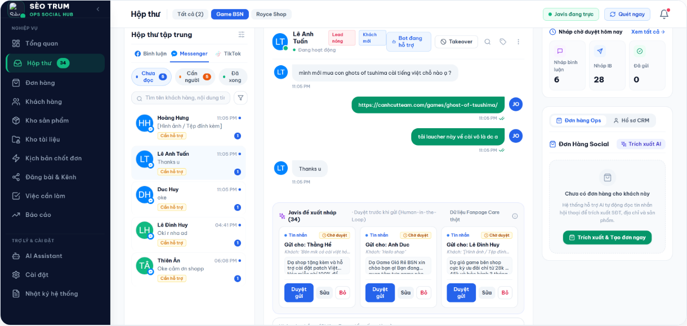
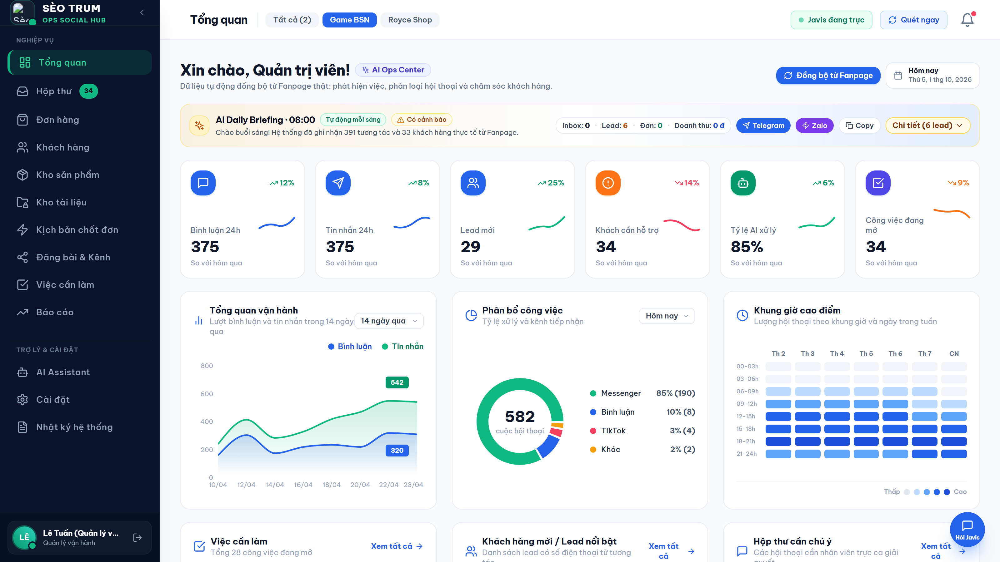
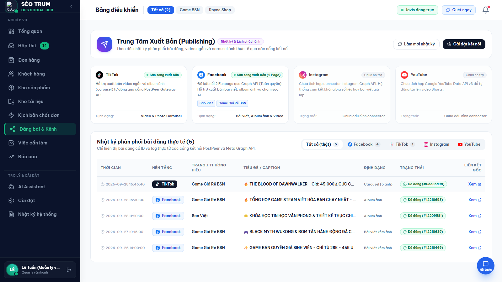
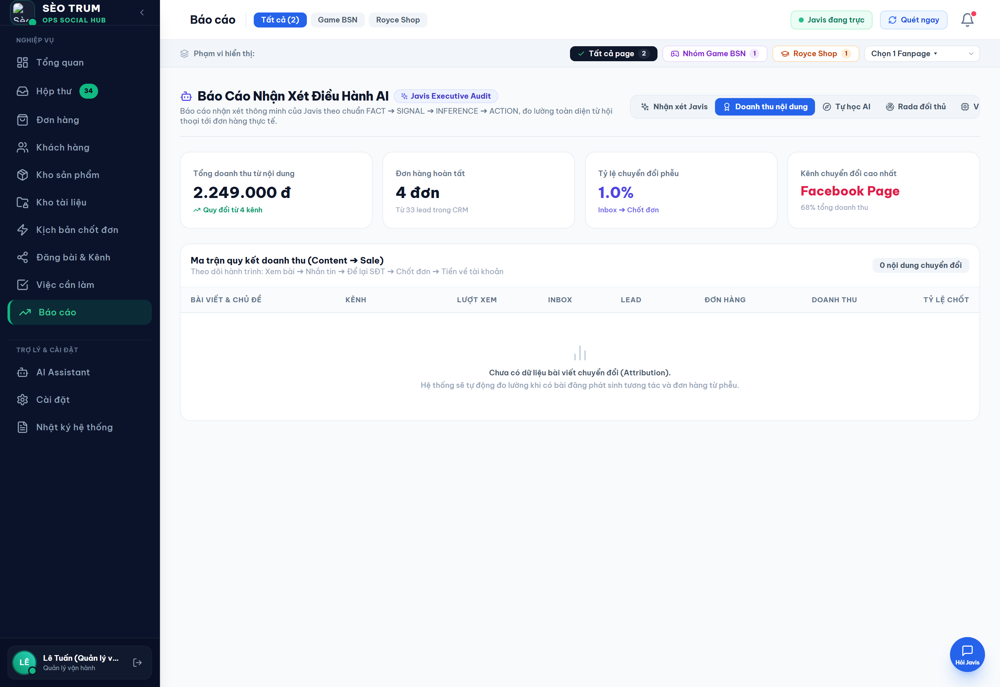

<div align="center">

# 🚀 SÈO TRUM (Auto Social AI)

**Nền tảng Tự động hóa Vận hành & Phân phối Nội dung Đa Kênh Cho Doanh Nghiệp SME. Đứng trên AI agentic đổi được bộ não Javis OS (MIT) - năng lực nằm ở Javis, không nằm ở model, hỗ trợ 11 nhà cung cấp.**  
*Mã nguồn mở (MIT License) · Tự host (Self-Hosted) · Bảo mật dữ liệu (Privacy-First)*

[](https://trannhuy.online)
[](https://github.com/ROYCE-8425/Auto_social/releases/tag/v1.0.1)
[](https://github.com/ROYCE-8425/Auto_social/actions)
[](https://github.com/ROYCE-8425/Auto_social/pkgs/container/auto_social)
[](LICENSE)
[](https://www.python.org/)
[](https://fastapi.tiangolo.com/)
[](https://react.dev/)

***Tiếng Việt** · [English](README.en.md)*

</div>

---

> [!NOTE]
> **Tuyên bố Nền tảng & Giấy phép MIT:**  
> Dự án **Sèo Trum** được phát triển trên nền tảng tác tử AI mã nguồn mở **[Javis OS](https://github.com/blogminhquy/javis-os)** (Bản quyền © 2026 Nguyễn Minh Quý - blogminhquy, giấy phép MIT).  
> Nhóm tác giả Sèo Trum kế thừa nhân xử lý tác tử và cổng kết nối công cụ (MCP Hub) của Javis OS, đồng thời thiết kế và phát triển mới hoàn toàn: **Hệ thống điều phối đa kênh (Social Channels Hub), Cổng xuất bản TikTok tự động, Hộp thư hợp nhất Human-in-the-Loop, CRM chấm điểm lead tự động và Cổng vận hành phân quyền RBAC (`/ops`)**.

> [!IMPORTANT]
> **Trạng thái mã nguồn mở:** Repo này được công bố như một dự án open source độc lập theo giấy phép MIT, có ghi công upstream Javis OS tại [NOTICE.md](NOTICE.md). Mọi người có thể fork, chạy thử, mở Issue/Pull Request theo [CONTRIBUTING.md](CONTRIBUTING.md). Không commit dữ liệu vận hành thật, token, API key hoặc file state cá nhân vào repo.

---

## 🌐 Trải nghiệm Trực tiếp (Live Demo)

Hệ thống Sèo Trum đã được triển khai sẵn trên máy chủ thực tế (Production Hosted Demo) để người dùng, ban giám khảo và cộng đồng trải nghiệm trực tiếp đầy đủ luồng tác vụ:

* **Trang chủ (Landing Page):** [https://trannhuy.online](https://trannhuy.online)
* **Cổng Vận hành CSKH & Xuất bản (`/ops`):** [https://trannhuy.online/ops](https://trannhuy.online/ops)
* **Buồng lái Lõi Javis OS (`/app`):** [https://trannhuy.online/app](https://trannhuy.online/app)
* **🎬 Video Giới thiệu & Thuyết minh (Walkthrough Video):** [Google Drive - Thư mục Nhóm 02](https://drive.google.com/drive/folders/1Eudly3w5h2rxF2jtZhurm6LLhHyXY_qZ?hl=vi)

### 🔑 Tài khoản Thử nghiệm (Demo Credentials)

Đăng nhập tại [https://trannhuy.online/ops](https://trannhuy.online/ops) bằng một trong các vai trò sau:

| Vai trò | Tên đăng nhập | Mật khẩu | Quyền hạn & Trải nghiệm thực tế |
|---|---|---|---|
| **Quản lý Vận hành (Manager)** | `ql_tuan` | `password123` | Xem báo cáo sáng 8h, duyệt nháp toàn quyền, xem ma trận Attribution ROI, quản lý CRM khách hàng, theo dõi lịch xuất bản đa kênh. |
| **Chuyên viên CSKH (Staff)** | `nv_thao` | `password123` | Hộp thư hợp nhất bình luận/tin nhắn Fanpage, duyệt nháp AI 30 giây, tạo đơn hàng nhanh, trích xuất SĐT. |
| **Kho vận & Đơn hàng (Warehouse)** | `kho_phong` | `password123` | Quản lý danh sách đơn hàng, tra cứu mã vận đơn Giao Hàng Nhanh (GHN), tính cước tự động theo trọng lượng. |
| **Marketing & TikTok (Marketing)** | `mkt_linh` | `password123` | Theo dõi lịch xuất bản TikTok video & carousel, quản lý Brand Kit, kiểm tra nhật ký phân phối bài đăng. |

### 📊 Phạm vi Dữ liệu & Trạng thái Kênh nối (Demo Scope)

| Kênh kết nối | Trạng thái Live | Tính năng hoạt động trên Demo | Ghi chú & Tính minh bạch |
|---|:---:|---|---|
| **Facebook Fanpage & Messenger** | 🟢 Live | Webhook quét bình luận & tin nhắn, phân loại ý định, trích xuất SĐT, lưu trữ bền vững bài viết đã đăng. | Đã kết nối 2 Fanpage thật (*Game Giá Rẻ BSN*, *Sao Việt*), 391 tương tác thực tế trong DB. |
| **TikTok Video & Photo Carousel** | 🟢 Live | Cổng PostPeer Gateway API, tự động lồng nhạc nền hot trend, xuất bản ảnh 9:16 thật theo Brand Kit. | Kết nối tài khoản `@seotrum`, có lịch sử bài đăng thực tế trong `tiktok-posts.jsonl`. |
| **Giao Hàng Nhanh (GHN API)** | 🟢 Live | Tính phí vận chuyển theo khối lượng/kích thước bưu kiện, tự động sinh mã vận đơn thật. | Sử dụng cổng kết nối GHN API. |
| **Instagram & YouTube Shorts** | 🟡 Kế hoạch | Giao diện điều phối sẵn sàng, hiển thị đúng kiến trúc phân phối 1:N. | Cam kết mã nguồn mở trung thực: Chưa tích hợp connector riêng, không bịa bài viết hay số liệu giả lập. |

---

## 📸 Hình ảnh Giao diện Thực tế (Visual Tour)

<div align="center">

| Trang chủ Giới thiệu (Landing Page) | Trung tâm Vận hành Sèo Trum Ops (`/ops`) |
|:---:|:---:|
|  |  |

| Trung tâm Xuất bản Đa Kênh (`/ops#/channels`) | Ma trận Chuyển đổi & Nhận xét Chiến dịch Javis |
|:---:|:---:|
|  |  |

</div>

---

## 🚪 Mô hình 3 Cửa Truy cập (Three Portals)

Hệ thống phân tách rành mạch không gian trải nghiệm theo đúng vai trò người dùng:

```
┌────────────────────────────────────────────────────────────────────────┐
│                          HỆ THỐNG SÈO TRUM                             │
├───────────────────┬──────────────────────────┬─────────────────────────┤
│    Cửa 1: `/`     │      Cửa 2: `/ops`       │       Cửa 3: `/app`     │
│   (Landing Page)  │     (Sèo Trum Ops)       │     (Buồng lái Lõi)     │
├───────────────────┼──────────────────────────┼─────────────────────────┤
│ Công chúng, khách │ Nhân viên CSKH (Staff),  │ Chủ máy (Owner),        │
│ ghé thăm tìm hiểu │ Quản lý vận hành (Mgr)   │ Kỹ sư vận hành hệ thống │
├───────────────────┼──────────────────────────┼─────────────────────────┤
│ Giới thiệu tính   │ Hộp thư duyệt nháp 30s,  │ Buồng lái AI, MCP Hub,  │
│ năng, bảng so     │ CRM & bắt số Lead nóng,  │ Second Brain Wiki, nạp  │
│ sánh, live demo   │ Social Hub, bảng Kanban  │ model AI, console máy   │
└───────────────────┴──────────────────────────┴─────────────────────────┘
```

| Cửa | Đường dẫn | Người dùng | Chức năng chính | Trải nghiệm trực tiếp |
|---|---|---|---|---|
| **Trang chủ** | `/` | Khách truy cập, đối tác | Landing Page hiện đại giới thiệu tính năng, kiến trúc, bảng so sánh và bảng giá tự host | [https://trannhuy.online](https://trannhuy.online) |
| **Vận hành** | `/ops` | Nhân viên CSKH & Quản lý | Không gian làm việc hằng ngày: Duyệt nháp trả lời, quản lý khách hàng CRM, theo dõi lịch đăng đa kênh, bảng việc Kanban, Báo cáo nhận xét Javis | [https://trannhuy.online/ops](https://trannhuy.online/ops) |
| **Buồng lái** | `/app` | Chủ máy (Owner) | Cấu hình bộ não AI, kết nối MCP, Second Brain Markdown, thanh điều hướng gom thành **7 nhóm** chức năng | [https://trannhuy.online/app](https://trannhuy.online/app) |

> [!TIP]
> **Ghi chú về mã nguồn mở & Build Artifacts:** Thư mục `ops/dist/` được tích hợp sẵn nhằm hỗ trợ người dùng tự host triển khai tức thì (*zero-build deployment*) mà không bắt buộc phải cài đặt Node.js/npm. Các nhà phát triển có thể tự build lại toàn bộ từ mã nguồn gốc bất kỳ lúc nào bằng lệnh `make build` hoặc `npm run build`. Chi tiết quy trình đóng gói xem tại [docs/RELEASE_PROCESS.md](docs/RELEASE_PROCESS.md) và [docs/OPEN_SOURCE_HEALTH.md](docs/OPEN_SOURCE_HEALTH.md).

---

## ⚡ Tính năng Cốt lõi (Core Features)

### 1. Trung tâm Phân phối Đa Kênh (Social Channels Hub)
- Điều phối tập trung 4 nền tảng mạng xã hội: **Facebook Fanpage & Messenger**, **TikTok Video & Shop**, **Instagram & Threads**, **YouTube Shorts & Channel**.
- Ma trận phân phối 1:N: Tái sử dụng 1 video ngắn 9:16 hoặc bộ ảnh carousel để tiếp cận 95% tệp khách hàng tiềm năng mà không tốn công biên tập nhiều lần.

### 2. Hộp thư Hợp nhất & Duyệt Nháp 30 Giây (Unified Care Inbox)
- Gom bình luận Fanpage và tin nhắn Messenger vào một luồng duy nhất theo thời gian thực.
- **Bộ lọc ý định (Rules-First Intent Classifier):** Nhận diện chính xác khách hỏi giá, tư vấn cấu hình, hỏi địa chỉ, check inbox hay khiếu nại.
- **Trích xuất số điện thoại tự động:** Tự động bắt SĐT từ bình luận/tin nhắn (hỗ trợ đầy đủ các định dạng số Việt Nam: `09x`, `08x`, `+84`, có dấu chấm/cách/gạch ngang).
- **Phòng chống ảo giác (Anti-Hallucination):** AI chỉ soạn nháp dựa trên thông tin có sẵn trong Brand Kit. Nhân viên bấm 1-click "Duyệt gửi" hoặc chỉnh sửa nhanh trước khi gửi.

### 3. Khách hàng CRM & Chấm điểm Lead Tự động
- Tự động xây dựng hồ sơ khách hàng từ dữ liệu tương tác mạng xã hội.
- Phân loại trạng thái vòng đời khách hàng: *Khách mới $\rightarrow$ Đang tư vấn $\rightarrow$ Đã để lại SĐT (Lead nóng) $\rightarrow$ Đã mua hàng $\rightarrow$ Khiếu nại*.
- Hỗ trợ gộp trùng khách hàng (Merge Profiles) đa kênh và gắn thẻ tag phân nhóm.

### 4. Xuất bản TikTok Tự động (PostPeer BYO Gateway)
- Tích hợp cổng xuất bản video ngắn và album ảnh carousel qua PostPeer API (hỗ trợ Bring Your Own API Key).
- Tính năng tự động lồng nhạc nền hot trend (`autoAddMusic=True`).
- Máy chủ phục vụ CDN nội bộ `/tiktok-media` đáp ứng đúng tiêu chuẩn kỹ thuật kiểm duyệt của TikTok Content API.

### 5. Quản lý Đa Thương hiệu (Multi-Brand Kit Resolver)
- Quản lý thông tin từng thương hiệu bằng các file Markdown độc lập.
- Cô lập dữ liệu hoàn toàn: Giá cả, hotline, kịch bản chốt đơn của thương hiệu này không bao giờ bị rò rỉ sang thương hiệu khác.

### 6. Bảo mật & Phân quyền RBAC 3 Cấp
- 3 vai trò độc lập:
  * `staff`: Nhân viên trực ca CSKH  -  chỉ được xem hộp thư trong phạm vi phân công, duyệt nháp, tra cứu thông tin ca trực.
  * `manager`: Quản lý vận hành  -  xem báo cáo phân tích, gộp dữ liệu CRM, điều phối bảng việc Kanban.
  * `owner`: Chủ máy  -  toàn quyền quản trị tài khoản, cấu hình hệ thống và mở buồng lái `/app`.
- Máy chủ bảo vệ route nghiêm ngặt: Tự động từ chối bằng HTTP 403 fail-closed khi tài khoản không đủ quyền.

---

## 🏗️ Kiến trúc Hệ thống (System Architecture)

```mermaid
flowchart TD
    %% Tầng 1: Kênh nối ngoại vi
    subgraph L1 ["1. Tầng Kênh nối & Khách hàng (External Channels)"]
        direction LR
        FB["📘 Facebook & Messenger\n(Meta Graph API v25.0)"]
        TT["🎵 TikTok Video & Shop\n(PostPeer Gateway)"]
        X_SOC["𝕏 X • 📸 Instagram • 📺 YouTube\n(Social Publishing)"]
        GHN["🚚 Giao Hàng Nhanh\n(Logistics API & Webhooks)"]
    end

    %% Tầng 2: Cổng tiếp nhận & Điều phối
    subgraph L2 ["2. Tầng Cổng tiếp nhận & Bảo mật (Gateway & Security)"]
        direction LR
        WH["⚡ Webhook Engine\n(GHN v2 & Graph Events)"]
        SYNC["🔄 Polling & Sync Services\n(Realtime Ingestion)"]
        SEC["🛡️ RBAC Auth & Web Security\n(Fail-closed 403)"]
    end

    %% Tầng 3: Lõi xử lý & Trí tuệ nhân tạo
    subgraph L3 ["3. Tầng Lõi Nghiệp vụ & AI (FastAPI Core)"]
        INBOX["💬 Unified Care Inbox\n(30s Human Review)"]
        DETECT["🔍 Regex Phone Extractor\n& Intent Classifier"]
        BRAND["🏷️ Multi-Brand Scope\n(Royce Shop / Game BSN)"]
        JAVIS["🧠 Javis OS Agentic Engine\n(Multi-LLMs, MCP & Skills)"]
    end

    %% Tầng 4: Lưu trữ dữ liệu
    subgraph L4 ["4. Tầng Lưu trữ Bền vững (Persistence Layer)"]
        direction LR
        DB[("🗄️ SQLite WAL Databases\n(fanpage_care, orders, crm)")]
        LOGS[("📋 JSONL Audit Logs\n(social-posts, logs)")]
        VAULT[("📚 Second Brain & Vault\n(Docs & Knowledge)")]
    end

    %% Tầng 5: Giao diện người dùng
    subgraph L5 ["5. Tầng Giao diện Người dùng (Presentation Portals)"]
        direction LR
        P_LAND["🌐 Public Landing (/)\nGiới thiệu & Bảng tính năng"]
        P_OPS["⚡ Sèo Trum Ops (/ops)\nĐiều hành, CRM & Đơn hàng"]
        P_APP["🎛️ Javis Cockpit (/app)\nBuồng lái Lõi & Studio"]
    end

    %% Luồng liên kết phân tầng một chiều từ trên xuống dưới
    L1 --> L2
    L2 --> L3
    L3 --> L4
    L4 --> L5
    L3 -.->|"Realtime API Data"| L5

    %% Styling màu sắc hiện đại, độ tương phản cao trên cả GitHub Dark và Light
    classDef chan fill:#1e293b,stroke:#38bdf8,stroke-width:1.5px,color:#f8fafc;
    classDef gate fill:#0f172a,stroke:#818cf8,stroke-width:1.5px,color:#f8fafc;
    classDef core fill:#1e1b4b,stroke:#c084fc,stroke-width:1.5px,color:#f8fafc;
    classDef store fill:#064e3b,stroke:#34d399,stroke-width:1.5px,color:#f8fafc;
    classDef ui fill:#451a03,stroke:#fbbf24,stroke-width:1.5px,color:#f8fafc;

    class FB,TT,X_SOC,GHN chan;
    class WH,SYNC,SEC gate;
    class INBOX,DETECT,BRAND,JAVIS core;
    class DB,LOGS,VAULT store;
    class P_LAND,P_OPS,P_APP ui;
```



---

## 🚀 Cài đặt & Triển khai Nhanh (Deployment)

### Cách 1: Chạy tức thì 1 Dòng lệnh với Docker (GHCR - Nhanh nhất)

Hình ảnh Docker chính thức của dự án đã được tự động đóng gói và xuất bản lên GitHub Container Registry (GHCR):

```bash
docker run -d -p 7777:7777 --name seotrum-ops ghcr.io/royce-8425/auto_social:latest
```

Truy cập ngay:
- **Trang chủ:** `http://localhost:7777/`
- **Sèo Trum Ops:** `http://localhost:7777/ops` (Đăng nhập: `ql_tuan` / `password123`)

---

### Cách 2: Triển khai bằng Docker Compose (Khuyến nghị trên VPS)

```bash
# 1. Clone repository
git clone https://github.com/ROYCE-8425/Auto_social.git seotrum
cd seotrum

# 2. Tạo file cấu hình từ file mẫu
cp env.example .env

# 3. Khởi chạy toàn bộ hệ thống bằng Docker Compose
docker compose up -d

# 4. Kiểm tra trạng thái container
docker compose ps
```

Sau khi khởi chạy thành công:
- **Landing Page:** `http://<ip-vps>:7777/`
- **Sèo Trum Ops:** `http://<ip-vps>:7777/ops`
- **Buồng lái Chủ máy:** `http://<ip-vps>:7777/app`

---

### Cách 3: Triển khai Trực tiếp trên Linux / macOS (Native Systemd)

```bash
git clone https://github.com/ROYCE-8425/Auto_social.git seotrum
cd seotrum

chmod +x install.sh
./install.sh
```

---

### Cách 4: Chạy trên Windows (Máy tính Cá nhân)

1. Cài đặt **Python 3.12** (chọn *"Add Python to PATH"*) và **Node.js LTS**.
2. Chạy file: `setup.bat` (tự động cài môi trường).
3. Khởi động hệ thống: `JAVIS OS.bat` hoặc chạy nền bằng `start-javis.vbs` (tự chạy khi mở máy: `javis-autostart.bat`).
4. Mở trình duyệt truy cập: `http://localhost:7777/ops`.
5. Dừng hệ thống: chạy `stop-javis.bat`.

---

## ⚠️ Giới hạn Đã biết & Tính Minh bạch (Known Limitations)

Để đảm bảo tính trung thực tuyệt đối theo tiêu chuẩn mã nguồn mở quốc tế:

1. **Instagram & YouTube Shorts:** Hiện tại hệ thống cung cấp giao diện điều phối và kiến trúc connector chuẩn bị tích hợp; chưa hỗ trợ xuất bản và đọc bình luận trực tiếp vì Instagram Graph API và YouTube Data API v3 yêu cầu quy trình thẩm định App Review riêng từ Meta và Google.
2. **Tài khoản TikTok Publishing:** Cổng xuất bản TikTok hoạt động thông qua PostPeer Gateway API (hỗ trợ mô hình BYO API Key). Để đăng video thật, doanh nghiệp cần cấu hình API key PostPeer của mình trong cài đặt.
3. **Kết nối Giao Hàng Nhanh (GHN):** Bản demo hỗ trợ tính phí vận chuyển và mô phỏng sinh mã vận đơn; triển khai môi trường Production thật cần `GHN_TOKEN` và `GHN_SHOP_ID` từ hợp đồng GHN của doanh nghiệp.
4. **Dữ liệu Demo & Riêng tư:** Toàn bộ số điện thoại và thông tin khách hàng trên máy chủ demo công khai đều được ẩn danh hóa (masking số điện thoại) để đảm bảo quyền riêng tư.

---

## ⚙️ Cấu hình Biến Môi trường (`.env`)

Sao chép `env.example` thành `.env` và điều chỉnh các thông số phù hợp:

| Biến | Ý nghĩa | Mặc định |
|---|---|---|
| `JAVIS_HOST` | Địa chỉ lắng nghe (`127.0.0.1` nội bộ hoặc `0.0.0.0` công khai) | `127.0.0.1` |
| `JAVIS_PORT` | Cổng dịch vụ HTTP | `7777` |
| `JAVIS_REQUIRE_LOGIN` | Bắt buộc đăng nhập tài khoản | `1` |
| `JAVIS_ADMIN_USER` | Tên tài khoản quản trị tối cao (Owner) | *(tự đặt)* |
| `JAVIS_ADMIN_PASSWORD` | Mật khẩu tài khoản quản trị tối cao | *(tự đặt)* |
| `DOMAIN_NAME` | Tên miền trỏ về máy chủ (tự cấp chứng chỉ SSL) | *(tùy chọn)* |
| `POSTPEER_API_KEY` | Khóa API PostPeer cho xuất bản TikTok Gateway | *(tùy chọn)* |
| `POSTPEER_TIKTOK_ACCOUNT_ID` | Mã định danh tài khoản TikTok kết nối | *(tùy chọn)* |
| `BRAINS_DIR` | Thư mục lưu trữ Second Brain và Brand Kit Markdown | `brains/` |

---

## 🔒 An toàn & Bảo mật Dữ liệu

- **Không rò rỉ khóa bí mật:** Toàn bộ token Facebook, API key PostPeer và biến môi trường nhạy cảm đều được lưu trong vault an toàn, không bao giờ commit vào Git.
- **Phòng chống tấn công Web:** Mặc định tích hợp bộ lọc chống tấn công CSRF, DNS-rebinding và giới hạn tần suất đăng nhập (Rate-limiting).
- **Fail-Closed RBAC:** Tất cả các endpoint nghiệp vụ `/ops/*` đều bắt buộc xác thực phiên và kiểm tra quyền hạn trước khi trả dữ liệu.

Trước khi public, release hoặc nộp bài dự thi, hãy rà lại [docs/OPEN_SOURCE_CHECKLIST.md](docs/OPEN_SOURCE_CHECKLIST.md).

---

## 🧪 Kiểm thử Tự động (Automated Testing)

Hệ thống được bảo vệ bởi bộ kiểm thử tự động toàn diện chạy trên GitHub Actions CI:

```bash
# Kiểm thử toàn bộ endpoint và phân quyền backend
python -m pytest tests/python -k "not test_browser"

# Kiểm thử route độc lập
python tests/python/test_ops_routes.py
python tests/python/test_ops_rbac.py
python tests/python/test_landing.py

# Build kiểm tra giao diện Ops Dashboard
cd ops && npm run build
```

---

## 📜 Bản quyền & Ghi công (Attribution & License)

Dự án phát hành dưới giấy phép mã nguồn mở **MIT License**:

- **Nền tảng Tác tử Lõi (Core Agentic Engine & MCP Hub):**  
  Kế thừa từ dự án [Javis OS](https://github.com/blogminhquy/javis-os)  
  Copyright (c) 2026 Nguyễn Minh Quý (blogminhquy)

- **Lớp Nghiệp vụ & Vận hành Sèo Trum (Social Hub, TikTok Automation, Fanpage Care CRM, Ops RBAC Portal):**  
  Copyright (c) 2026 Nhóm phát triển Sèo Trum (`ROYCE-8425/Auto_social`)

Xem chi tiết điều khoản cấp phép tại [LICENSE](LICENSE) và [NOTICE.md](NOTICE.md).

## 🤝 Cộng đồng & Đóng góp

- Hướng dẫn đóng góp: [CONTRIBUTING.md](CONTRIBUTING.md)
- Báo cáo bảo mật riêng tư: [SECURITY.md](SECURITY.md)
- Kênh hỗ trợ & báo lỗi: [SUPPORT.md](SUPPORT.md)
- Quy tắc ứng xử: [CODE_OF_CONDUCT.md](CODE_OF_CONDUCT.md)
- Danh sách ghi công: [AUTHORS.md](AUTHORS.md)
- Báo cáo sức khỏe mã nguồn mở: [docs/OPEN_SOURCE_HEALTH.md](docs/OPEN_SOURCE_HEALTH.md)
- Quy trình phát hành: [docs/RELEASE_PROCESS.md](docs/RELEASE_PROCESS.md)

---

<div align="center">

**SÈO TRUM  -  Đồng hành cùng doanh nghiệp SME làm chủ kỷ nguyên tự động hóa AI.**  
Mọi đóng góp, báo lỗi (issue) và Pull Request đều được hoan nghênh trên [GitHub Repository](https://github.com/ROYCE-8425/Auto_social).

</div>
