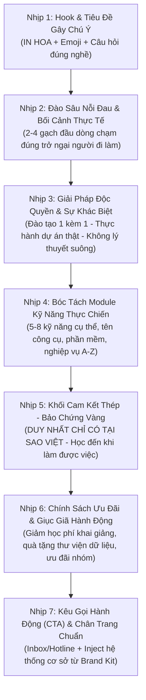

# Cẩm Nang Phân Tích Luồng Bài Viết Thực Chiến - Hệ Thống Tin Học Sao Việt

Tài liệu này không phải văn bản sao chép cơ học, mà là **Khung Phân Tích Luồng Tâm Lý & Copywriting Thực Chiến (Flow-Based Copywriting Framework)** đúc kết từ 11 bài viết thực tế có tỷ lệ chuyển đổi cao nhất của Hệ Thống Đào Tạo Tin Học Sao Việt.

Mọi Agent hoặc Model khi tạo nội dung Fanpage đều phải đọc và triển khai bài viết theo đúng **7 nhịp luồng** dưới đây, kết hợp kho từ vựng và ví dụ thực chiến của từng ngành cụ thể.

LƯU Ý KỸ THUẬT: Tuyệt đối không dùng ký tự em dash trong toàn bộ tài liệu và bài viết (dùng ký tự gạch nối thông thường -). Chân trang hệ thống 12-13 cơ sở được inject tự động từ Brand Kit, không dán cứng lặp lại trong nội dung phân tích.

---

# PHẦN 1: KIẾN TRÚC LUỒNG BÀI VIẾT CHUẨN SAO VIỆT (THE 7-STEP UNIVERSAL FLOW)

Mỗi bài viết bán khóa học hoặc tuyển sinh của Sao Việt đều dẫn dắt người đọc qua một hành trình tâm lý 7 bước chặt chẽ:



### Chi tiết 7 nhịp triển khai:
1. **Nhịp 1 (Hook & Tiêu đề):** Bắt đầu bằng Emoji nổi bật (🚀, 🎨, 📐, 📣, 🎓), Tiêu đề chính IN HOA nêu bật kết quả/giải pháp, kết hợp ngay 1 câu hỏi đánh thẳng vào nghề nghiệp (Ví dụ: "Học kế toán có khó không?", "Có bao nhiêu việc đang làm thủ công mỗi ngày?").
2. **Nhịp 2 (Nỗi đau thực tế - Agitation):** Dùng 2 đến 4 gạch đầu dòng (❓ hoặc 👉) nêu chính xác tình huống bế tắc của người học: làm sai báo cáo, cầm bản vẽ bị xưởng trả về, mất cả buổi loay hoay layer/hàm excel... Không nói chung chung, phải nói đúng tình huống công việc.
3. **Nhịp 3 (Giải pháp cốt lõi):** Giới thiệu khóa học như giải pháp trực diện. Khẳng định ngay giá trị cốt lõi của Sao Việt: Học kèm 1-1, học thực hành 80-100%, không giới hạn số buổi, học đến khi làm được việc.
4. **Nhịp 4 (Chi tiết kỹ năng - Value Delivery):** Dùng số thứ tự hoặc emoji (✅ 1️⃣ 2️⃣...) liệt kê 5 đến 8 năng lực người học sẽ làm chủ. Bắt buộc có tên phần mềm, công cụ, hoặc nghiệp vụ cụ thể.
5. **Nhịp 5 (Cam kết thép - Trust Anchor):** Nhấn mạnh khối uy tín mang tính thương hiệu: "DUY NHẤT CHỈ CÓ TẠI TRUNG TÂM ĐÀO TẠO TIN HỌC SAO VIỆT". Cam kết dạy đến khi thành thạo, hỗ trợ nghiệp vụ trọn đời sau khóa học, cấp chứng chỉ giá trị toàn quốc.
6. **Nhịp 6 (Ưu đãi & Quà tặng):** Chính sách giảm 20-30% học phí cho người đăng ký sớm, tặng bộ thư viện dữ liệu (thư viện 300GB đồ họa, thư viện bản vẽ 500k...), ưu đãi học viên cũ và đăng ký theo nhóm.
7. **Nhịp 7 (CTA & Chân trang):** Lời kêu gọi ngắn gọn, dứt khoát ("Inbox ngay để nhận tư vấn lộ trình và ưu đãi", "Hotline/Zalo hỗ trợ 24/7"). Chân trang tự động gắn danh sách cơ sở từ Brand Kit.

---

# PHẦN 2: PHÂN TÍCH LUỒNG CHI TIẾT 11 BÀI MẪU THEO 5 NHÓM NGÀNH

---

## NHÓM 1: ĐÀO TẠO KẾ TOÁN THỰC HÀNH CHUYÊN SÂU

### 1. Phân Tích Luồng Bài Mẫu 1: Kế Toán Thực Hành Chuyển Đổi (Tổng Hợp 6 Lĩnh Vực)
- **Mục tiêu chuyển đổi:** Thu hút người chưa có nền tảng hoặc bỏ nghề lâu năm, mong muốn thành thạo kế toán tổng hợp để được săn đón.
- **Luồng 1 - Hook & Khơi gợi tò mò:**
  > ❓ Kế toán: Học Kế Toán Có Khó Không?  
  > Ngành Kế toán không chỉ đơn thuần là ghi chép sổ sách mà toàn bộ câu chuyện kinh doanh và những bí mật của doanh nghiệp đều có thể tìm thấy được ở bộ phận kế toán.
- **Luồng 2 - Đánh trúng đối tượng băn khoăn:**
  > ❓❓❓ Bạn chưa có nền tảng về kế toán và muốn bắt đầu từ đầu? Bạn đang băn khoăn rằng "Học Kế Toán Có Khó Không?" Hay bạn đã từng học kế toán nhưng đã lâu không sử dụng?
- **Luồng 3 - Giải pháp định vị bao phủ 6 loại hình doanh nghiệp:**
  > 📢 Hãy tham gia ngay khóa học Chuyên Viên Kế Toán Tổng Hợp của Kế Toán Sao Việt - Tự tin làm chủ kiến thức và kỹ năng chỉ sau 1 khóa học.  
  > Ứng dụng thực hành vào 6 lĩnh vực: Sản xuất | Thương mại | Dịch vụ | Xây lắp | Vận tải | Nhà hàng - khách sạn.
- **Luồng 4 - Bóc tách 8 module kỹ năng A-Z từ kinh nghiệm thực chiến:**
  > 🎓 Lộ trình tôi rèn tính thực chiến trên bộ chứng từ thực tế của doanh nghiệp:  
  > 1️⃣ Thành thạo nghiệp vụ Kế toán từ A-Z: báo cáo thuế, báo cáo tài chính, quyết toán thuế.  
  > 2️⃣ Xử lý hóa đơn chứng từ, tình huống kế toán với các loại hình doanh nghiệp.  
  > 3️⃣ Hạch toán các nghiệp vụ kinh tế phát sinh.  
  > 4️⃣ Xây dựng hệ thống sổ sách, ghi sổ, kết chuyển, quyết toán thuế.  
  > 5️⃣ Lập chứng từ, lên Báo Cáo Tài Chính trên Excel và phần mềm Misa, Fast...  
  > 6️⃣ Nắm vững thông tư, nghị định hiện hành.  
  > 7️⃣ Kỹ năng giải trình, quyết toán thuế khi Cơ Quan Thuế thanh tra, kiểm tra.  
  > 8️⃣ Tự tin nhận thêm sổ sách của các doanh nghiệp khác về làm ngoài giờ để tăng thu nhập.
- **Luồng 5 - Khối cam kết vàng độc quyền:**
  > ⭐ DUY NHẤT CHỈ CÓ TẠI TRUNG TÂM ĐÀO TẠO KẾ TOÁN SAO VIỆT:  
  > 📌 Dạy đến khi nào bạn thành thạo mọi kỹ năng (học đến khi phải làm được việc).  
  > 📌 Không giới hạn thời gian và số buổi thực hành.  
  > 📌 Thời gian học linh động (có lớp buổi tối và cuối tuần).  
  > 📌 Tài liệu học là bộ chứng từ thực tế của doanh nghiệp.  
  > 📌 Cấp Chứng chỉ "Chuyên Viên Kế Toán Tổng Hợp" có giá trị toàn quốc.  
  > 📌 Hỗ trợ nghiệp vụ kế toán trọn đời sau khi hoàn thành khóa học.
- **Luồng 6 & 7 - Ưu đãi & CTA:**
  > 🎁 INBOX ngay cho Kế Toán Sao Việt để nhận tư vấn miễn phí và ưu đãi học phí trong tuần!

---

### 2. Phân Tích Luồng Bài Mẫu 7: Kế Toán Ngắn Hạn (Bảng Giá & Cam Kết Hoàn Phí)
- **Mục tiêu chuyển đổi:** Chốt đơn khách hàng quan tâm đến chi phí, cam kết việc làm và thời gian đào tạo nhanh.
- **Luồng 1 - Định vị đầu ra cực mạnh:**
  > 🎓 Khóa Học Kế Toán Tổng Hợp Thực Hành Ngắn Hạn Dành Cho Người Chưa Có Kinh Nghiệm!  
  > ✅ Tự tin xử lý mọi nghiệp vụ kế toán từ cơ bản đến phức tạp chỉ sau 3 tháng.  
  > ✅ Học xong tự tin ứng tuyển vị trí Kế toán tổng hợp.  
  > ✅ Mức thu nhập kỳ vọng khởi điểm vững vàng.
- **Luồng 2 - Cam kết rủi ro bằng 0 (Risk Reversal):**
  > 🔖 KHÔNG RA NGHỀ SẼ HOÀN TRẢ HỌC PHÍ!  
  > 🔖 KHÔNG GIỚI HẠN THỜI GIAN - HỌC ĐẾN KHI THÀNH THẠO!
- **Luồng 3 - Minh bạch bảng giá ưu đãi:**
  > 🎉 BẢNG HỌC PHÍ ƯU ĐÃI KHAI GIẢNG:  
  > 📌 Kế Toán Cho Người Mới Bắt Đầu: Giảm từ 5.500.000đ còn 4.550.000đ  
  > 📌 Kế Toán Tổng Hợp Thực Tế: Giảm từ 4.500.000đ còn 4.000.000đ  
  > 📌 Kế Toán Thực Hành Sổ Sách Theo Yêu Cầu: Giảm từ 4.500.000đ còn 3.000.000đ
- **Luồng 4 - Lịch học linh hoạt & 4 phần kiến thức trọng tâm:**
  > 🕒 Lịch học linh động: Ca sáng (8h30 - 11h), Ca tối (17h - 21h), 2-4-6 hoặc 3-5-7.  
  > 📚 4 Trọng tâm: (1) Nguyên lý kế toán căn bản -> (2) Kế toán tổng hợp & Báo cáo tài chính -> (3) Kế toán thuế chuyên sâu -> (4) Xử lý tình huống thực tế và sai sót doanh nghiệp.

---

## NHÓM 2: ĐÀO TẠO THIẾT KẾ ĐỒ HỌA & MULTIMEDIA

### 3. Phân Tích Luồng Bài Mẫu 2: Thiết Kế Đồ Họa Cấp Tốc Đa Nền Tảng
- **Mục tiêu chuyển đổi:** Khơi dậy đam mê sáng tạo cho người làm marketing, kinh doanh online cần tự làm ảnh và ấn phẩm.
- **Luồng 1 & 2 - Hook mở lối & Đặt vấn đề:**
  > 🎨 KHÓA HỌC THIẾT KẾ ĐỒ HỌA TẠI TIN HỌC SAO VIỆT - NÂNG CAO KỸ NĂNG SÁNG TẠO  
  > 🚀 Bạn yêu thích thiết kế và muốn tự tay tạo nên những ấn phẩm truyền thông chuyên nghiệp?
- **Luồng 3 - Giải pháp 4 trong 1:**
  > 🎯 Thành thạo trọn bộ công cụ Photoshop, Illustrator, CorelDRAW, InDesign - ứng dụng trực tiếp cho marketing, quảng cáo, in ấn và truyền thông số.
- **Luồng 4 - Lộ trình đào tạo 6 module ứng dụng:**
  > 🔹 Module 1: Nhập môn và tư duy thị giác, mỹ thuật ứng dụng.  
  > 🔹 Module 2: Thiết kế ấn phẩm cơ bản (logo, poster, banner, brochure).  
  > 🔹 Module 3: Kỹ thuật chỉnh sửa, cắt ghép, retouch và phối màu ảnh với Photoshop.  
  > 🔹 Module 4: Vẽ Vector, bộ nhận diện thương hiệu với Illustrator.  
  > 🔹 Module 5: Thiết kế ấn phẩm in ấn, chế bản xuất file nhà in với CorelDRAW / InDesign.  
  > 🔹 Module 6: Xây dựng Portfolio cá nhân chuẩn chỉnh để đi làm hoặc nhận dự án freelance.
- **Luồng 5 & 6 - Quyền lợi học viên & Quà tặng:**
  > ✅ Thực hành trên máy tính cấu hình cao tại trung tâm. Giảng viên cầm tay chỉ việc 1 kèm 1. Cấp chứng chỉ chuyên viên thiết kế đồ họa sau khóa.

---

### 4. Phân Tích Luồng Bài Mẫu 10: Nghề Designer Chuyên Nghiệp 3 Tháng (Đi Làm Ngay)
- **Mục tiêu chuyển đổi:** Nhắm vào học sinh tốt nghiệp THPT, sinh viên, người muốn chuyển nghề cấp tốc sang Graphic Design trong 3 tháng.
- **Luồng 1 - Tiêu đề cam kết mạnh mẽ:**
  > THÀNH THẠO NGHỀ THIẾT KẾ ĐỒ HỌA - TRỞ THÀNH DESIGNER CHUYÊN NGHIỆP TRONG 3 THÁNG - TỐT NGHIỆP ĐI LÀM NGAY!
- **Luồng 2 - Xoáy 4 câu hỏi định vị đúng từng hoàn cảnh:**
  > ❓ Chưa biết gì về vẽ có thể trở thành Designer được không?  
  > ❓ Đang gặp khó khăn khi mò mẫm phần mềm thiết kế trên mạng?  
  > ❓ Học sinh mới tốt nghiệp muốn học nghề ngắn hạn để đi làm kiếm thu nhập sớm?  
  > ❓ Người đi làm trái ngành muốn học để tự thiết kế quảng cáo cho shop hoặc làm Freelancer?
- **Luồng 3 - Khác biệt đào tạo 80% thực hành:**
  > ✅ Đào tạo "chuyên gia thực hành", không đào tạo "chuyên gia lý thuyết". 80% thời lượng là thao tác dự án thực tế.
- **Luồng 4 - 8 Kỹ năng làm chủ công cụ và mỹ thuật:**
  > ✅ 1. Tư duy sáng tạo mỹ thuật đồ họa và bố cục thị giác.  
  > ✅ 2. Quy trình thiết kế ấn phẩm truyền thông đa kênh.  
  > ✅ 3. Chỉnh sửa, cắt ghép, blend màu chuyên sâu với Photoshop.  
  > ✅ 4. Vẽ minh họa vector, thiết kế nhận diện thương hiệu với Illustrator.  
  > ✅ 5. Thiết kế kỹ thuật in ấn với Corel DRAW.  
  > ✅ 6. Dàn trang sách báo, tạp chí với InDesign.  
  > ✅ 7. Dựng video ngắn truyền thông với Premiere.  
  > ✅ 8. Hoàn thiện đồ án và Portfolio xin việc.
- **Luồng 5 - Quà tặng bom tấn kích thích đăng ký:**
  > 🎁 TẶNG NGAY BỘ THƯ VIỆN 300 GB BỐ CỤC VÀ TÀI NGUYÊN THIẾT KẾ ĐỒ HỌA ĐỘC QUYỀN.  
  > 🔥 Giảm 30% học phí khi đăng ký sớm. Đăng ký nhóm nhận thêm quà tặng đến 300k.

---

## NHÓM 3: ĐÀO TẠO VẼ KỸ THUẬT AUTOCAD 2D & 3D

### 5. Phân Tích Luồng Bài Mẫu 5: AutoCAD 2D & 3D Đọc Bản Vẽ Cơ Khí & Xây Dựng
- **Mục tiêu chuyển đổi:** Kỹ sư công trình, thợ xưởng cơ khí, thợ mộc nội thất, sinh viên ngành kỹ thuật cần vẽ chuẩn ISO để sản xuất không bị lỗi.
- **Luồng 1 - Tiêu đề kỹ thuật chuẩn chỉ:**
  > 📐 KHÓA HỌC VẼ KỸ THUẬT AUTOCAD 2D & 3D TẠI TIN HỌC SAO VIỆT - THÀNH THẠO BẢN VẼ CƠ KHÍ & XÂY DỰNG 📐
- **Luồng 2 - Xoáy 4 nỗi đau cay đắng tại xưởng và công trình:**
  > ❓ Bạn có đang gặp những trở ngại này khi làm việc với bản vẽ kỹ thuật?  
  > 👉 Cầm bản vẽ xuống xưởng bị thợ trả về vì thiếu kích thước, sai dung sai lắp ghép.  
  > 👉 Ngồi cả buổi loay hoay chỉnh từng nét vẽ, quản lý layer rối bời, in ấn sai tỷ lệ chuẩn.  
  > 👉 Muốn bóc tách khối lượng, dựng hình 3D cơ bản nhưng chưa làm chủ công cụ.  
  > 👉 Đọc hiểu bản vẽ kết cấu còn chậm, thiếu tự tin khi làm việc với đối tác hoặc chủ đầu tư.  
  > 💡 Muốn gia công chuẩn xác và thi công đúng tiến độ, bản vẽ trên máy phải chuẩn ngay từ đầu!
- **Luồng 3 - Giải pháp thực chiến kèm 1-1 theo ngành riêng:**
  > 🚀 Giáo viên hướng dẫn 1 kèm 1 sát năng lực và ngành nghề riêng của học viên (Cơ khí, Kiến trúc, Xây dựng, Nội thất).
- **Luồng 4 - 6 Module kỹ năng chuẩn hóa ISO:**
  > ✅ Quản lý hệ thống Layer chuẩn ISO, phím tắt và thao tác vẽ tốc độ cao.  
  > ✅ Thiết lập tỷ lệ bản vẽ trong Model và Layout, in ấn đúng chuẩn 1:1, 1:20, 1:50, 1:100.  
  > ✅ Đọc hiểu, bóc tách chi tiết bản vẽ cơ khí, mặt cắt, hình chiếu, ký hiệu dung sai.  
  > ✅ Chuẩn hóa Dimension, Text Style, bảng kê vật tư.  
  > ✅ Dựng hình không gian 3D, xuất phối cảnh trực quan.  
  > ✅ Ứng dụng AutoLisp để tối ưu hóa thời gian vẽ.
- **Luồng 5 & 6 - Cam kết & Ưu đãi ngành:**
  > ⭐ Học đến khi làm được việc mới kết thúc khóa. Không tính theo số buổi.  
  > 🎁 Tặng trọn bộ thư viện bản vẽ cơ khí - nội thất - xây dựng trị giá 500k. Giảm 20-30% học phí khai giảng.

---

## NHÓM 4: AI & TỰ ĐỘNG HÓA DOANH NGHIỆP (AUTOMATION & AI AGENTS)

### 6. Phân Tích Luồng Bài Mẫu 3: n8n AI Automation for Business
- **Mục tiêu chuyển đổi:** Chủ doanh nghiệp nhỏ, quản lý vận hành, marketer muốn giải phóng sức lao động thủ công bằng tự động hóa quy trình.
- **Luồng 1 - Hook đánh thẳng vào lãng phí thời gian:**
  > ❓ CÓ BAO NHIÊU VIỆC TRONG DOANH NGHIỆP CỦA BẠN ĐANG LÀM THỦ CÔNG MỖI NGÀY?  
  > Nhập liệu, làm báo cáo, chăm sóc khách hàng, gửi email, phân loại lead, cập nhật Google Sheet, nhắc lịch... đều có thể tự động hóa bằng n8n kết hợp AI.
- **Luồng 2 - Chuyển hướng sang giải pháp workflow:**
  > Khóa học N8N AI Automation For Business tại Sao Việt giúp bạn tự xây dựng workflow tự động hóa theo đúng quy trình thực tế của chính doanh nghiệp mình.
- **Luồng 3 - Điểm khác biệt công nghệ:**
  > ✅ Tích hợp ChatGPT/Gemini vào quy trình xử lý dữ liệu tự động.  
  > ✅ Kết nối Google Sheet, CRM, Email, Website, Zalo, Telegram.  
  > ✅ Tự tay deploy n8n lên VPS/Cloud để làm chủ dữ liệu nội bộ an toàn 100%.
- **Luồng 4 - 7 Giá trị thực hành End-to-End:**
  > 🎯 Sau khóa học, hoàn thiện ít nhất 1 quy trình End-to-End áp dụng ngay vào công ty:  
  > 1. Nắm vững tư duy logic và kiến trúc hệ thống n8n.  
  > 2. Thiết kế workflow đa nền tảng kết nối Database, Webhook, API.  
  > 3. Tích hợp AI phân tích số liệu và tự động phản hồi khách.  
  > 4. Gửi báo cáo tự động theo thời gian thực về Telegram/Zalo.  
  > 5. Xử lý bắt lỗi (Error Trigger) đảm bảo hệ thống chạy mượt mà 24/7.  
  > 6. Tối ưu chi phí vận hành nhân sự.

---

### 7. Phân Tích Luồng Bài Mẫu 4: Xây Dựng Hệ Thống AI Agents Vận Hành Doanh Nghiệp
- **Mục tiêu chuyển đổi:** Doanh nghiệp muốn nâng cấp từ "chat thủ công" sang "đội ngũ nhân sự AI tự động hóa".
- **Luồng 1 - Câu hỏi thức tỉnh tư duy công nghệ:**
  > ❓ DOANH NGHIỆP CỦA BẠN ĐANG DÙNG AI, HAY CHỈ MỚI "GÕ LỆNH" VỚI AI?  
  > ❌ Doanh nghiệp không chỉ cần biết dùng AI. Doanh nghiệp cần một "ĐỘI NGŨ AI" có thể làm việc thật!
- **Luồng 2 - Nêu rõ bối cảnh khoảng cách công nghệ:**
  > ChatGPT hay Claude rất mạnh, nhưng nếu chỉ để hỏi từng câu thì chưa tạo ra đột phá vận hành. Doanh nghiệp cần: AI hiểu tài liệu nội bộ, tra cứu đúng báo giá, tư vấn khách 24/7, tự kết nối CRM và xuất báo cáo.
- **Luồng 3 - Giới thiệu khái niệm AI Agents cụ thể:**
  > 📌 AI Marketing tự động tạo nội dung và kịch bản video.  
  > 📌 AI CSKH trả lời khách theo tài liệu nội bộ (Knowledge Base).  
  > 📌 Bộ não RAG giúp AI hiểu sâu dữ liệu riêng mà không lộ bí mật kinh doanh.  
  > 📌 Workflow kết nối AI Agent với Google Sheets, Gmail, CRM.
- **Luồng 4 - Bảo chứng bằng số lượng học viên:**
  > ⭐ HƠN 5000+ HỌC VIÊN ĐÃ TRẢI NGHIỆM VÀ ĐÁNH GIÁ CAO VÌ: Giáo viên 1 kèm 1 trên chính dữ liệu thật của học viên, học đến khi vận hành trơn tru.

---

### 8. Phân Tích Luồng Bài Mẫu 6: Workshop Vibe Coding - Xây Dựng Hệ Thống Bằng AI
- **Mục tiêu chuyển đổi:** Người không biết lập trình muốn tự tạo website, công cụ quản lý bán hàng mà không cần thuê lập trình viên.
- **Luồng 1 - Tiêu đề cuốn hút và hạ thấp rào cản:**
  > 🚀 WORKSHOP VIBE CODING: XÂY DỰNG & PHÁT TRIỂN HỆ THỐNG VỚI AI AGENT  
  > Bạn không cần biết code, không cần thuê đội ngũ kỹ thuật và không cần chuẩn bị kiến thức trước!
- **Luồng 2 - Trực quan hóa thành quả cầm về ngay cuối buổi:**
  > CUỐI BUỔI, BẠN CẦM VỀ ĐƯỢC GÌ?  
  > ✅ Một trang web chạy trực tiếp trên Internet, có đường link riêng để gửi cho nhân viên, khách hàng.  
  > ✅ Dữ liệu nhập vào được lưu lại vĩnh viễn (tắt máy mở lại vẫn còn).  
  > ✅ Có phân quyền: Khách vào trang mua hàng, chủ shop đăng nhập trang quản lý đơn hàng.  
  > ✅ Sản phẩm thực tế có thể sử dụng và phát triển tiếp, không phải bản demo xem cho vui.
- **Luồng 3 - Giải thích nguyên lý một cách bình dân, dễ hiểu:**
  > Hãy hình dung bạn đang có một người thợ xây rất giỏi. Bạn chỉ cần mô tả rõ muốn xây phòng khách ra sao, cửa sổ đặt ở đâu bằng tiếng Việt, người thợ AI sẽ dựng lên chính xác.
- **Luồng 4 - Sản phẩm minh họa & Chân dung người tham gia:**
  > Phù hợp: Chủ shop quản lý kho/đơn hàng, người quản lý bằng quá nhiều file Excel, người có ý tưởng khởi nghiệp nhưng thiếu đội ngũ kỹ thuật.

---

## NHÓM 5: TIN HỌC VĂN PHÒNG, TRẺ EM & CHỨNG CHỈ QUỐC TẾ

### 9. Phân Tích Luồng Bài Mẫu 11: Ứng Dụng AI Trong Văn Phòng (Làm Việc Thông Minh Hơn)
- **Mục tiêu chuyển đổi:** Nhân viên văn phòng, kế toán, giáo viên bị quá tải công việc giấy tờ, báo cáo, muốn tăng năng suất gấp 2-3 lần.
- **Luồng 1 & 2 - Hook đánh vào sự kiệt sức văn phòng:**
  > 📣 KHAI GIẢNG KHÓA HỌC ỨNG DỤNG AI TRONG VĂN PHÒNG  
  > ✨ Làm việc thông minh hơn - Tăng tốc hiệu quả công việc với AI ✨  
  > ❓ Bạn luôn bị quá tải bởi các công việc lặp lại: xử lý số liệu Excel, viết báo cáo, làm slide PowerPoint?  
  > ❓ Đã nghe nói về ChatGPT, Copilot, Canva AI nhưng chưa biết áp dụng vào thực tế công việc hàng ngày?
- **Luồng 3 - Chân dung 5 nhóm đối tượng hưởng lợi trực tiếp:**
  > ✅ Nhân viên văn phòng: Giảm 70% thời gian làm báo cáo và slide thuyết trình.  
  > ✅ Giáo viên: Soạn giáo án, tạo trò chơi tương tác và đề thi tự động.  
  > ✅ Nhân sự, kế toán: Tạo bảng lương, quy trình, mô tả công việc (JD) nhanh chóng.  
  > ✅ Sinh viên, người tìm việc: Tạo lợi thế cạnh tranh với kỹ năng công nghệ số.  
  > ✅ Chủ doanh nghiệp: Tối ưu nhân lực và phân tích dữ liệu kinh doanh.
- **Luồng 4 - 4 Trụ cột nội dung thực tế:**
  > 🔹 Trụ cột 1: ChatGPT ứng dụng hằng ngày (viết email, nội dung truyền thông, hàm Excel).  
  > 🔹 Trụ cột 2: Microsoft Copilot trong Word, Excel, PowerPoint.  
  > 🔹 Trụ cột 3: Notion AI, Canva AI thiết kế tài liệu và slide thuyết trình chuyên nghiệp.  
  > 🔹 Trụ cột 4: Kỹ thuật Prompt Engineering - Cách đặt câu hỏi để AI trả lời đúng ngay, không loanh quanh.
- **Luồng 5 - Thông điệp truyền cảm hứng chốt bài:**
  > 💡 Thời đại AI không phải là thời đại thay thế con người, mà là thời đại của những người biết dùng AI vượt lên trên những người không dùng!

---

### 10. Phân Tích Luồng Bài Mẫu 8: Tin Học & Ứng Dụng AI Cho Trẻ Em (Khóa Hè)
- **Mục tiêu chuyển đổi:** Phụ huynh có con trong độ tuổi học sinh muốn tìm khóa học hè bổ ích, an toàn, vừa chơi vừa học kỹ năng số.
- **Luồng 1 & 2 - Chạm vào nỗi lo phụ huynh:**
  > 🔔 BA MẸ ƠI - HÈ NÀY HÃY CÙNG TIN HỌC SAO VIỆT ĐÁNH THỨC TIỀM NĂNG CÔNG NGHỆ CHO BÉ!  
  > Ba mẹ đang tìm một khóa học hè bổ ích giúp con không chỉ dán mắt vào điện thoại mà biết dùng máy tính để học tập, sáng tạo và tư duy?
- **Luồng 3 - Giải pháp toàn diện, an toàn cho trẻ:**
  > Khóa học Tin học - Ứng dụng AI cho trẻ em giúp bé tiếp cận công nghệ dễ hiểu, an toàn và phát triển tư duy logic.
- **Luồng 4 - 10 Trải nghiệm kỹ năng cho bé:**
  > ✅ Làm quen máy tính, chuột, bàn phím chuẩn khoa học.  
  > ✅ Soạn thảo văn bản Word, làm bài tập trình bày đẹp mắt.  
  > ✅ Làm quen bảng tính Excel qua bài toán vui, trò chơi quản lý tài chính nhỏ.  
  > ✅ Tự thiết kế slide thuyết trình PowerPoint sinh động cho bài thuyết trình trên lớp.  
  > ✅ Rèn luyện tư duy lập trình trò chơi cơ bản với Scratch và Python.  
  > ✅ Khám phá AI như người bạn trợ lý học tập an toàn.  
  > ✅ Thiết kế đồ họa và mô hình 3D cơ bản với Photoshop và SketchUp.
- **Luồng 5 - Môi trường giáo dục thân thiện:**
  > Giáo viên tận tâm, kiên nhẫn, kèm cặp theo lứa tuổi. Không gian học an toàn, kích thích sự tò mò và sáng tạo của trẻ nhỏ.

---

### 11. Phân Tích Luồng Bài Mẫu 9: Luyện Thi Chứng Chỉ Quốc Tế MOS (Word, Excel, PowerPoint)
- **Mục tiêu chuyển đổi:** Sinh viên cần chuẩn đầu ra tốt nghiệp, người đi làm cần bằng cấp quốc tế để thăng tiến hoặc hoàn thiện hồ sơ.
- **Luồng 1 - Khẳng định vị thế chứng chỉ toàn cầu:**
  > 🎯 LUYỆN THI CHỨNG CHỈ TIN HỌC QUỐC TẾ MOS TẠI TIN HỌC SAO VIỆT 🏆  
  > Nắm bắt cơ hội sở hữu chứng chỉ MOS giá trị toàn cầu của Microsoft, khẳng định năng lực vượt trội trong công việc và học tập!
- **Luồng 2 - 4 Lợi thế luyện thi cam kết đậu cao:**
  > ✅ Giáo trình chuẩn quốc tế, bám sát 100% cấu trúc đề thi thật.  
  > ✅ Giảng viên chuyên gia MOS Master trực tiếp hướng dẫn phương pháp giải đề nhanh.  
  > ✅ Thực hành trên hệ thống phần mềm luyện thi thử nghiệm chuẩn xác như thi thật.  
  > ✅ Thi thử miễn phí để đánh giá chính xác năng lực trước khi bước vào kỳ thi chính thức.
- **Luồng 3 - CTA & Hỗ trợ thủ tục thi:**
  > 💬 Để lại bình luận hoặc inbox ngay để nhận lịch thi, đề cương ôn tập và học phí ưu đãi sinh viên!

---

# PHẦN 3: QUY TẮC TRÍCH XUẤT CHÂN TRANG (FOOTER RESOLUTION)

Trong toàn bộ 11 bài mẫu ở trên, phần chân trang 12-13 cơ sở đào tạo là **cấu trúc tĩnh được tự động quản lý bởi Brand Kit (`wiki/brand-kits/`) hoặc script `kit_chan_trang.py`**.

### Quy chuẩn ghép chân trang khi tạo bài:
Khi AI sinh bài viết thực tế cho Fanpage, phần thân bài kết thúc ở **Nhịp 6 (Ưu đãi)** và dòng **Nhịp 7 (CTA Inbox/Hotline)**. Phần danh sách chi nhánh bên dưới sẽ được tự động nối theo mẫu sau:

```text
TRUNG TÂM TIN HỌC SAO VIỆT
Website: tinhocsaoviet.com
Hotline: 093 1144 858 - 0823 552 558
Hệ thống cơ sở:
[Inject danh sách 12-13 chi nhánh tương ứng với từng page/thương hiệu từ Brand Kit]
```

**Bằng cách này:**
- Bài viết giữ nguyên 100% cấu trúc sâu, nhịp điệu cuốn hút và kỹ năng thực chiến chuẩn Sao Việt.
- Không bị lãng phí token vào việc lặp đi lặp lại hàng trăm dòng địa chỉ cơ sở.
- AI hiểu sâu bản chất copywriting theo từng ngành và sản xuất ra bài viết có hồn, giàu tính thuyết phục.
