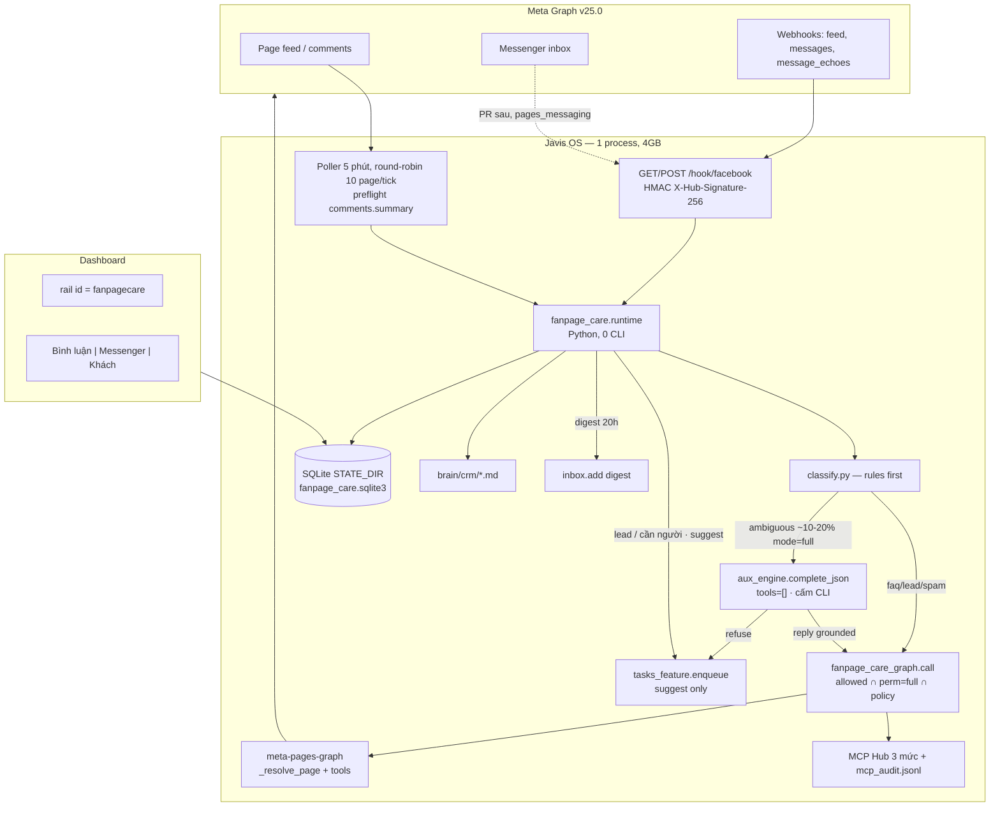
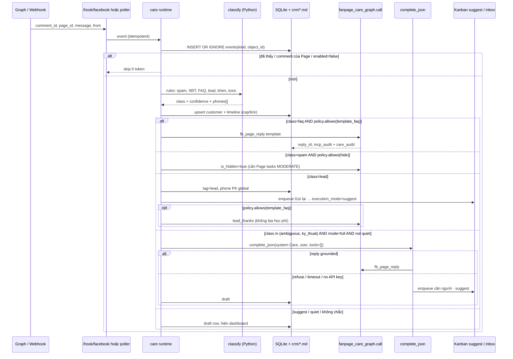

# Fanpage Care: hộp thư bình luận, Messenger và CRM khách hàng cho Javis OS

| Trường | Giá trị |
| --- | --- |
| **Trạng thái** | Draft (đã sửa sau review 2026-09-16) |
| **Tác giả** | Javis (design) |
| **Ngày** | 2026-09-16 |
| **Phiên bản mục tiêu** | Javis OS 0.55.13 trở đi |
| **Phạm vi** | Trung tâm Sao Việt — nhiều Fanpage tuyển sinh (tin học, đồ họa, kế toán, AutoCAD, trẻ em) |
| **Ràng buộc hạ tầng** | VPS 2 vCPU / 4 GB RAM / 30 GB, Việt Nam |

---

## Overview

Javis OS hôm nay **đăng** được lên Fanpage (plugin `meta-pages-graph`, connector `facebook-pages`, loop xoay tua ~50 brand kit) nhưng **không chăm sóc** phễu sau bài đăng. `fb_page_reply` là tool thủ công cho agent; `fb_page_comments` chỉ đọc bình luận của **một** bài; không có webhook, không có hộp thư, không có CRM, không có vòng lặp tự trả lời. Chatbot (`docs/25-chatbot.md`, `server/chatbot_runtime.py`) chỉ Telegram/Zalo và là **Agent công khai với brain riêng** — không được tái sử dụng cho khách Facebook, vì bot chủ Telegram chạy `mode=full`.

Fanpage Care là lớp **chăm sóc + bán hàng** đặt lên trên hạ tầng đăng bài hiện có. Nó nuốt bình luận (và sau đó tin Messenger) từ các Trang đã nối, phân loại bằng **luật Python trước, LLM sau**, trả lời FAQ từ đúng brand kit/course của Trang đó, bắt lead (SĐT Việt Nam), ghi CRM trong vault, và đẩy việc mơ hồ sang Kanban cho người. Mặc định **không gửi gì ra Graph**. Comments ship trước trên **cùng chế độ Development + admin Page** mà `fb_page_reply` đang dùng hôm nay (scope `pages_manage_engagement` đã có; **không** App Review vì v1 **không Live**). Messenger là PR sau, vẫn Development trước; Live + App Review chỉ khi cần nhắn học viên thật.

---

## Background & Motivation

### Hiện trạng đã kiểm trong mã (không suy diễn)

| Thành phần | File | Việc đang làm | Việc **không** làm |
| --- | --- | --- | --- |
| Connector | `system/mcp-catalog.json` id `facebook-pages` (~dòng 567) | OAuth Graph v25.0, scope `pages_show_list`, `pages_read_engagement`, `pages_manage_posts`, `pages_manage_engagement`. `default_perm: readonly`. `auth_type=rerequest` lúc Kết nối lại (`server/oauth_mcp.py:296`). | **Không** có `pages_messaging`, `pages_read_user_content`, `pages_manage_metadata`. Không mô tả webhook. |
| Plugin | `system/plugins/meta-pages-graph/plugin.py` + `plugin.yaml` | 10 tool. Đọc: `fb_pages_list`, `fb_page_posts`, `fb_page_comments`. Ghi `min_mode=full`: `fb_page_post/photo/album/video/edit/delete/reply`. Token Trang qua `_resolve_page` (page_tokens.json / brand-kit / `/me/accounts`). `GRAPH = https://graph.facebook.com/v25.0`. | `fb_page_reply` (~1188–1323) POST `{comment_id\|post_id}/comments`. Không loop, không webhook, không hộp thư. `fb_page_comments` cần **một** `post_id`. |
| Loop | `brains/Brain Default/Javis/loops/*.md` | Chỉ đăng bài. Preflight zero-token: `pick_next_fanpage.py` → `NEXT=NONE` thì không spawn LLM (`wiki/Zero-Token Preflight cho loop định kỳ.md`, `server/self_improve.py`). | Không quét bình luận. |
| Brand kit | `wiki/brand-kits/*.md` (~50+ file) | Page ID, hotline/Zalo, địa chỉ cơ sở, thẻ khóa học, giọng. `_load_page_kit()` đã parse. | Không có FAQ reply templates, không có học phí máy đọc được. Course files (`wiki/courses/*.md`) cũng **không** ghi số học phí — luật "CẤM bịa học phí" đã có trong kit. |
| Chatbot | `docs/dev/2026-08-bot-chuyen-trach-spec.md` | Telegram/Zalo, brain riêng, grounding `chatbot_grounding.py` (cấm `inbox/`, `attachments/`, `CLAUDE.md`). | Không Facebook. Bot chủ Telegram = full power. |
| Plugin cá nhân | CHANGELOG | `fb-personal` đã xóa (mbasic chết + ToS). | **Không hồi sinh cookie scraping.** |
| Hòm thư | `server/inbox.py` | Kết quả việc nền. Trần 300 thư, STATE_DIR. | Không phải CRM. `inbox/` + `attachments/` trong brain là cache 30 ngày / 300MB (`server/media_gc.py`) — **cấm** nhét khách vào đó. |
| Kanban | `server/tasks.py` `enqueue()`, plugin `javis-task` | Giao việc in-process, không POST HTTP (tránh hở `/kanban/task` khỏi auth). `javis_task` **từ chối** `mode=full`. | Chưa có loại việc "lead Fanpage". |
| Hub | `server/mcp_hub.py` + `server/mcp_catalog.py` | 3 mức: connection `perm` ∩ loop `mode`. `suggest` → readonly, `auto` → max safe, `full` → theo perm. Audit `STATE_DIR/mcp_audit.jsonl`. Plugin handler (`_reply`) **không** tự kiểm perm — lớp đó nằm ở Hub `allowed()`. | Worker Care **không** gọi raw `_reply`. Mọi Graph đi qua `fanpage_care_graph.call` (mục 5.3) — `mcp_catalog.allowed` + policy + hai audit. |

Đau: bài đăng ra rồi học viên comment "học phí bao nhiêu / ở Q7 học được không / SĐT 09xx" thì Javis im. Nhân viên phải ngồi inbox native của 50 Trang. Lead rơi. Spam ở lại. Không có lịch sử khách.

### Bối cảnh kinh doanh

Trung tâm Sao Việt: đào tạo nghề, nhiều cơ sở, **một Fanpage ≈ một cơ sở × một ngành**. Mục tiêu bài = tuyển sinh + kiến thức. Comment/inbox **mới là phễu bán**. Câu hỏi lặp: học phí, lịch (sáng/chiều/tối), địa chỉ, khai giảng, "ib Zalo số này", "muốn học Excel/AutoCAD/MISA".

---

## Goals & Non-Goals

### Goals

1. Hộp thư bình luận đa Trang: ingest (webhook ưu tiên, poll fallback), phân loại, trả lời có kiểm soát, ẩn spam.
2. Hộp thư Messenger (giai đoạn sau, cùng token Trang, scope mới + Development mode trước).
3. CRM khách trong brain: một hồ sơ / người, timeline, SĐT, ngành, cơ sở, tag.
4. Điều phối an toàn: kill switch, quiet hours, rate limit, 3 mode, audit mọi Graph write.
5. Chạy được trên VPS 4 GB: preflight 0 token, không spawn Claude Code CLI mỗi comment, tối đa 1 LLM call nhỏ khi thật sự cần câu người.
6. Một Javis, nhiều Page: `page_id` → brand kit → course files của **đúng** Trang đó, inventory = kit ∩ resolvable trong `fanpage_care.brain`.

### Non-Goals

- Trình quản lý Facebook Ads (đã có `meta-ads-graph`).
- Lịch đăng bài (loop + `fb_page_album` đã có).
- Tự động hóa profile cá nhân (đã xóa, ToS).
- Biến Fanpage Care thành Chatbot chuyên trách (brain riêng, token Telegram). Khách Facebook **không** được cầm chìa khóa owner brain.
- Lead Ads Meta (phase 2+, quyền ads, sản phẩm khác).
- Tự gửi Zalo cho người lạ khi họ comment "alo Zalo".
- Hàng đợi thứ hai cạnh Kanban.
- Gọi `aux_engine.swap()` / `_ApiAuxEngine.query()` / Kanban `execution_mode=auto` từ Care.

---

## Key Decisions

1. **Comments trước, Messenger sau, v1 không Live.** Trả lời bình luận công khai dùng đúng scope `pages_manage_engagement` **đã có** — cùng chế độ Development + admin Page với `fb_page_reply` hôm nay. Câu “không App Review” **chỉ đúng Development**. Live/Advanced Access thì `pages_manage_engagement` cũng phải App Review (y hệt đăng bài). v1 **không** đưa app Live. `pages_messaging` vẫn App Review khi Live — Messenger Development trước.
2. **Không plugin Facebook thứ hai.** Tool Graph ở lại `system/plugins/meta-pages-graph/`. Webhook + classifier + CRM + worker là module FastAPI `server/fanpage_care.py` (khuôn `learn.py` / `tasks.py`: `register(app, deps)`, không `import main`).
3. **Worker Python; LLM = `aux_engine.complete_json`; Kanban chỉ handoff người.** Webhook/poll → classify in-process → template FAQ qua `fanpage_care_graph.call`. Class `ambiguous`/`ky_thuat` + `mode=full` → **một** `complete_json(system, user, timeout_s=20, tools=[])` (mục 6.3). **Cấm** `aux_engine.swap()`, **cấm** `_ApiAuxEngine.query()` (hôm nay chúng default `anthropic-cli` và `discover_all` + prompt “BẮT BUỘC GỌI fb_page_album”). **Cấm** enqueue Kanban `execution_mode=auto` từ Care — runner Kanban dựng full engine + MCP, đúng thứ Goal 5 cấm. Kanban chỉ `suggest` + `capability=mcp-read` cho người.
4. **CRM hybrid.** SQLite `STATE_DIR/fanpage_care.sqlite3` = nguồn vận hành (dedup, inbox event, rate, cửa sổ 24h). Markdown `crm/customers/<id>.md` + `crm/index.md` trong **brain** `fanpage_care.brain` = hồ sơ kinh doanh. Token **không** bao giờ vào markdown. Xóa khách + checkbox loại `crm/` khỏi git backup (mục 7.4) vì PDPD.
5. **Rail `fanpagecare` nằm nhóm Kết nối**, cạnh `channels` / `mcp`. Đây là hộp thư kênh Facebook, không phải bảng Việc. Việc mơ hồ **tạo** Kanban task, không sống trong Care như hàng đợi thứ hai.
6. **Mode mặc định `suggest` + `enabled: false`.** `auto` gửi **template FAQ** (deterministic) + ghi CRM; không LLM, không Messenger. `full` mới comment LLM + Messenger + ẩn/xóa. Mọi Graph write đi `fanpage_care_graph.call`: `mcp_catalog.allowed(..., perm, mode="full")` **và** `perm=="full"` **và** policy. Fail closed nếu connection readonly.
7. **Classifier rules-first.** Keyword + regex SĐT VN + spam list. LLM chỉ cho class `ambiguous` / `ky_thuat` còn lại (~10–20%), qua `complete_json`. Grounding: chỉ kit + course của **page_id đó** (strip `access_token`), tái sử dụng `BO_QUA` / `BO_QUA_FILE`.
8. **Identity không gộp mù.** `comment_from_id` ≠ PSID — cả hai **page-scoped**. Gộp mạnh chỉ khi trùng SĐT đã chuẩn hóa (`identities.kind=phone` với `page_id=''` — PK toàn cục), hoặc nhân viên bấm Gộp, hoặc (phase 2) private-reply trả về PSID. Tên trùng không đủ.
9. **Webhook `feed` cần `pages_manage_metadata`** (POST `/{page-id}/subscribed_apps`). Scope này **chưa có**. Polling comments chạy được **ngay** với scope hiện tại → PR ingest đầu = poll. Webhook là PR riêng, xin thêm `pages_manage_metadata` (Development + admin tự cấp; Live mới App Review).
10. **Không dùng chatbot_runtime.** Bài học spec bot chuyên trách: kênh khách ≠ bot chủ. Care chạy trong brain `fanpage_care.brain` nhưng prompt chỉ nhận kit/course; không MCP POS/Ads; không `/brain`.
11. **Inventory poller = kit ∩ resolvable, gắn `fanpage_care.brain`.** Setting bắt buộc `brain` (default `"Brain Default"`). Tập page = Page ID trong `wiki/brand-kits/*.md` (không `_`) của **đúng brain đó** ∩ page `_resolve_page` lấy được, trừ `pages.{id}.enabled=false`. `pages` map rỗng = mọi kit-page đủ điều kiện, vẫn bị `enabled` toàn cục. **Không** quét `/me/accounts` unbounded.
12. **Mọi Graph Care đi `fanpage_care_graph.call`.** Không raw `_reply`/`_hide`. Wrapper: load connection `facebook-pages` → `mcp_catalog.allowed` → policy → `plugins_host` wrapped call `mode="full"` chỉ sau khi pass → ghi **cả** `mcp_audit.jsonl` và `fanpage_care_audit.jsonl`. Cấm gọi `_publish` / `_caption_kit_err` (reply ngắn sẽ `POST_SKIP`). `_reply` phải chạy `_fb_plain_caption`.

---

## Proposed Design

### 1. Kiến trúc tổng



### 2. Luồng một bình luận (sequence)



### 3. Module server mới

Khuôn `server/routes/__init__.py`: `register(app, deps)`, **cấm** `import main`. Gọi `register` trong `server/main.py` cạnh `tasks_mod.register` (~7846), và **thêm path vào `tests/python/route_table.json`** (thứ tự route bị khóa).

| File | Vai trò |
| --- | --- |
| `server/fanpage_care.py` | Feature: router, webhook, settings, poller asyncio (single-flight), digest cron. |
| `server/fanpage_care_store.py` | SQLite WAL, schema, dedup, rate. **Không FTS v1** — search `LIKE` SĐT/tên. |
| `server/fanpage_care_classify.py` | Luật + gold interface. **Không** import engine. |
| `server/fanpage_care_crm.py` | Đọc/ghi markdown CRM, merge identity (phone PK global), xóa PDPD. |
| `server/fanpage_care_policy.py` | `MODE_RANK`; `allows(action)` từ mode × class × quiet × rate × kill. |
| `server/fanpage_care_graph.py` | `call(tool, args, *, actor)` — Hub `allowed` + perm=full + policy; hai audit; không `_publish`. |
| `server/fanpage_care_ground.py` | Allowlist kit+course của đúng page; strip `access_token`. |
| `server/quiet_hours.py` | Extract `_QH_RE` / `_in_quiet_hours` khỏi `self_improve.py`. **Không** `cron_util`. |
| `system/fanpage_care/templates.md` | Template FAQ mặc định (read-only). Kit có thể override `## Care templates`. |
| `dashboard/fanpage-care.js` | UI Alpine ủy quyền, giống `chatbots.js` / `brand-kits-ui.js`. |
| `tests/python/test_fanpage_care_classify.py` | Gold fixtures, 0 mạng; parent+child `filter=stream`. |
| `tests/python/test_fanpage_care_webhook.py` | HMAC raw body, challenge, replay, `verb=edited`. |
| `tests/python/test_fanpage_care_policy.py` | Bảng mode × class; `MODE_RANK`. |
| `tests/python/test_fanpage_care_poller.py` | Fake `_get`, freeze time, single-flight, cursor skip, cap/tick. |
| `tests/python/test_fanpage_care_graph.py` | perm=readonly / kill / suggest → không POST. |
| `tests/python/test_aux_complete_json.py` | Cấm CLI provider; `tools=[]`; prompt không `fb_page_album` / `CLAUDE.md`. |
| `tests/fixtures/fanpage_care_classify_gold.json` | Corpus tiếng Việt Sao Việt. |

`fanpage_care.py` nhận `FanpageCareDeps` (`brain` từ settings, `vault_root` của **đúng** brain đó, settings r/w, `tasks_feature`, `inbox.add`). Poller: **một** `asyncio.Task`; tick sau phải `if running: return`. Interval `poll_interval_min` (mặc định 5). Vault CRM = `BRAINS_DIR / fanpage_care.brain` — **không** “brain đang chọn trên UI”.

### 4. Mở rộng plugin `meta-pages-graph`

Giữ `CONNECTOR_ID = "facebook-pages"`, `_resolve_page`, `_load_page_kit`, `GRAPH v25.0`. **Không** lộ page token trong output (luật `fb_pages_list`).

#### 4.1 Sửa tool đọc hiện có

`fb_page_comments` thêm field Graph:

`id,from{id,name},message,created_time,like_count,comment_count,parent,is_hidden,can_comment,can_hide,can_like,can_remove,message_tags,attachment{type,url}`

`from` có thể **thiếu** (privacy Meta, thiếu `pages_read_user_content`) → runtime vẫn dedup theo `comment_id`, tên = "Ẩn danh". Không coi thiếu `from` là lỗi. Inbox vẫn chạy; CRM không-SĐT không gộp được sau — PR 4 có thể rerequest `pages_read_user_content` nếu gold production cho `from` rỗng.

Thêm args: `since` (ISO), `filter` (Care **mặc định `stream`** — mục 4.2), `after` cursor.

#### 4.2 Tool mới — Comments (scope hiện có, ship PR đầu)

**`fb_page_inbox_comments`** — `min_mode=readonly`

Quét bình luận mới trên N bài gần nhất của **một** Trang. Đây là primitive cho poller; agent cũng gọi được khi user hỏi "comment mới page Q7".

```json
{
  "type": "object",
  "properties": {
    "page_id": {"type": "string"},
    "page": {"type": "string"},
    "posts_limit": {"type": "integer", "description": "Số bài quét, mặc định 5, max 15"},
    "comments_per_post": {"type": "integer", "description": "Mặc định 25, max 50"},
    "since": {"type": "string", "description": "ISO8601; bỏ trống = 24h"},
    "filter": {"type": "string", "description": "Care mặc định stream (cả reply lồng). Agent có thể bỏ."}
  }
}
```

Thuật toán (0 LLM):

1. `_resolve_page`.
2. `GET {page-id}/feed?fields=id,created_time,comments.summary(true).limit(0)&limit={posts_limit}`.
3. Bỏ bài `comments.summary.total_count == 0`.
4. So với cursor SQLite `page_cursors(page_id, post_id, last_count, last_seen_comment_id)`. **Không đổi count → không GET comments.**
5. **Mặc định Care:** `GET {post-id}/comments?filter=stream&fields=...&order=chronological&limit={comments_per_post}`. `filter=stream` lấy **cả reply lồng** — nếu không, sau FAQ reply của Care, khách trả lời con sẽ **câm**. Gold-test một cặp parent+child.
6. Nếu Graph v25.0 trả lỗi filter (unknown/deprecated): fallback (a) GET top-level, (b) với mỗi `comment_id` Care đã `actions.action=reply` trên post đó, `GET {comment-id}/comments`. Ghi `stream_ok=false` vào state để UI biết. **Chốt trước PR 4** bằng một probe mock + comment trong test; không để implementer đoán.
7. Trả JSON: `{page_id, page_name, items:[{comment_id,post_id,parent_id,from_id,from_name,message,created_time,is_hidden,like_count}], scanned_posts, skipped_unchanged}`.

Đây là **Zero-Token Preflight** của Care: tick rỗng = vài GET summary, không model. Webhook `item=reply` và poll `filter=stream` **cùng** `UNIQUE(kind, object_id)` — không double-reply.

**`fb_page_comment_hide`** — `min_mode=full`

```json
{
  "type": "object",
  "required": ["comment_id"],
  "properties": {
    "comment_id": {"type": "string"},
    "is_hidden": {"type": "boolean", "description": "true ẩn, false hiện lại. Mặc định true"},
    "page_id": {"type": "string", "description": "Bắt buộc trừ khi suy được từ comment_id/post_id"},
    "page": {"type": "string"},
    "post_id": {"type": "string"}
  }
}
```

Graph: `POST /{comment-id}` body `is_hidden=true|false`. Cần `pages_manage_engagement` (đã có, Development). **Suy Page** (bắt buộc trên tài khoản ~50 Trang — `_reply` hôm nay **không** suy, sẽ lỗi “cần chỉ rõ page_id”):

1. Nếu `page_id` / `page` có → `_resolve_page` như cũ.
2. Else nếu `post_id` hoặc `comment_id` dạng `{pageid}_…` **và** prefix khớp một page đã resolve → dùng prefix đó (cùng luật `_comments` ở `plugin.py:544–545`).
3. Else → ERROR rõ, **không** đoán khi có nhiều Trang.
4. Comment id thuần số (không prefix) → **bắt buộc** `page_id`.

Test `test_meta_pages.py` **phải** stub **2 page** (suite hiện tại 1 page — miss). Hide: trước POST, đọc `tasks` của Page token (`_pages` đã fetch). Thiếu `MODERATE` → skip, **không** coi Graph 200 là spam. Worker không hide page thiếu MODERATE.

**`fb_page_comment_like`** — `min_mode=full`

Cùng schema suy `page_id` như hide. `POST /{comment-id}/likes`. Mặc định **tắt** ở policy. Chỉ bật per-page `like_khen=true` và class `khen`.

**`fb_page_comment_delete`** — `min_mode=full`, catalog `danger` — **ship PR 1** (cùng hide/like, cùng suy page).

`DELETE /{comment-id}`. Không hoàn tác. Worker **không** tự gọi. Chỉ agent khi user nói rõ, hoặc allowlist spam **và** mode=full **và** `delete_spam=true` (mặc định false — ẩn an toàn hơn xóa).

**`_reply` (sửa PR 1):** gọi `_fb_plain_caption(message)` trước POST (hiện `_reply` bỏ qua — `**` hiện trên tường). **Cấm** chạy `_caption_kit_err` / `_publish` trên reply (ngưỡng 20 dòng sẽ `POST_SKIP` mọi FAQ). Cùng suy `page_id` như hide (50 Trang; worker Care luôn truyền `page_id` từ inventory, agent thì không).

#### 4.3 Tool mới — Messenger (PR sau, `pages_messaging`)

**`fb_conversations`** — readonly  
`GET /{page-id}/conversations?fields=id,updated_time,message_count,unread_count,participants,snippet&limit=`

**`fb_conversation_thread`** — readonly  
`GET /{conversation-id}/messages?fields=id,from,to,message,created_time,attachments`

**`fb_message_send`** — full  
`POST /{page-id}/messages`

```json
{
  "type": "object",
  "required": ["page_id", "recipient_id", "message"],
  "properties": {
    "page_id": {"type": "string"},
    "recipient_id": {"type": "string", "description": "PSID"},
    "message": {"type": "string"},
    "messaging_type": {"type": "string", "enum": ["RESPONSE", "UPDATE"], "description": "Mặc định RESPONSE. Không gửi MESSAGE_TAG tự động."}
  }
}
```

Trước khi gửi: worker kiểm `messaging_windows(page_id, psid).last_user_message_at` < 24h. Hết cửa sổ → **không** gọi Graph, ghi `needs_human`, Kanban. Không im lặng.

**`fb_private_reply`** — full, phase 2 (cùng Messenger)

Meta mâu thuẫn: edge `/{object-id}/private_replies` trên docs v26.0 vẫn còn nhưng header nói đã gỡ sau v3.2. Đường **khuyến nghị 2026**: Send API với `recipient: {comment_id: "..."}` — **đòi `pages_messaging`**. Comments-first **không** ship private reply.

#### 4.4 Catalog `tool_meta` sau khi đủ tool

```json
"tool_meta": {
  "read": [
    "fb_pages_list", "fb_page_posts", "fb_page_comments",
    "fb_page_inbox_comments",
    "fb_conversations", "fb_conversation_thread"
  ],
  "danger": [
    "fb_page_post", "fb_page_photo", "fb_page_album", "fb_page_video",
    "fb_page_edit", "fb_page_reply", "fb_page_delete",
    "fb_page_comment_hide", "fb_page_comment_like", "fb_page_comment_delete",
    "fb_message_send", "fb_private_reply"
  ]
}
```

`fb_page_comment_hide/like/delete` là Graph write công khai → xếp **danger** (không `write`/safe). Loop `auto` không tự ẩn/like qua agent. Worker Care **vẫn** gọi `mcp_catalog.allowed(connector, perm, mode="full", tool, args)` trong `fanpage_care_graph.call` — không lách Hub; policy Care là lớp **thêm**, không thay.

`plugin.yaml`: `tools:` append tên mới **cùng PR** với `register()`. `min_mode:` cấp plugin vẫn `full` (default); per-tool `fb_page_inbox_comments` / `fb_page_comments` = `readonly` (override đã có). Test `tests/python/test_meta_pages.py:69` khóa đúng 10 tool — **đổi assertion theo từng PR**.

### 5. Ingest

**Inbound wake (sản phẩm, Open Q 2):** khách comment trên bài Page hoặc nhắn Messenger vào Page → Graph **bắn API** vào Javis (webhook `POST /hook/facebook` ưu tiên; poller 5 phút fallback khi chưa HTTPS/`subscribed_apps`) → Care runtime classify / CRM / policy. Không cần mở dashboard. Đó là “bên FB có tin thì Javis hoạt động”. Khác với **echo nhân viên** (mục 12): tin do staff gửi từ inbox native Meta không phải inbound khách — Care **không** trả lời thêm thread đó.

#### 5.0 Inventory + brain (bắt buộc, không đoán)

```
fanpage_care.brain = "Brain Default"   # required; default Sao Việt
vault              = BRAINS_DIR / brain
eligible_ids       = Page ID trong wiki/brand-kits/*.md (bỏ _*.md) của vault đó
resolvable_ids     = page _resolve_page lấy được (manual page_tokens + /me/accounts)
poll_set           = eligible_ids ∩ resolvable_ids − { id | pages[id].enabled is false }
```

- `pages` map **rỗng** = mọi kit-page đủ điều kiện, **vẫn** bị `fanpage_care.enabled` (default false).
- Page có trong `/me/accounts` nhưng **không** có kit → **không** poll (FAQ sẽ draft vô hạn / bịa địa chỉ).
- Page có kit nhưng token không resolve → skip, đếm `unresolved` trên `/fanpage-care/state`.
- Poller **không** quét unbounded `/me/accounts`.
- CRM markdown luôn ghi vào `vault` của `fanpage_care.brain`, không theo “brain đang chọn” trên navbar (không có khái niệm đó lúc `asyncio` startup).

Hàm `eligible_pages()` thuần, test với temp vault 2 kit + 1 page tokens.

#### 5.1 Polling (PR 4, scope cũ)

- Interval mặc định **5 phút**, không 1 phút.
- **Single-flight:** một `asyncio.Task` poller. Đầu tick: `if self._tick_running: return`. Tick chậm (10 × timeout 30s) **không** chồng tick sau — đó là failure mode 4 GB.
- Mỗi tick: tối đa `pages_per_tick=10` từ `poll_set` round-robin (50 page phủ ~25 phút).
- Semaphore Graph **2** (không parallel 10 page). `_get` đã `httpx.AsyncClient(timeout=30)` — không block loop, nhưng 10 client song song vẫn tốn RAM/FD.
- Preflight: chỉ `feed` + `comments.summary`. Count không đổi → 0 GET comments, 0 LLM.
- `since` = `max(created_time)` đã ingest; **first-run / cursor rỗng = now−24h** (không backfill lịch sử).
- **`max_events_per_tick=100`**, **`max_new_customers_per_tick=40`**. Viral post nhảy nghìn comment: ingest 100 rồi dừng batch, cursor tiến tới comment cuối đã lấy — tick sau lấy tiếp. Cold start không được 10×5×50 = 2500 CRM write.
- Timeout một page → **bỏ phần còn lại của batch**, không retry trong cùng tick. Tick phải xong < `poll_interval_min` (assert trong `test_fanpage_care_poller.py` với clock giả).
- GET comments: `filter=stream` (mục 4.2).
- Bỏ `from.id == page_id`. Bỏ `UNIQUE(kind, object_id)` đã có.
- **`enabled=false`:** không poll, webhook 200 rồi drop — **không** ingest. Đây là công tắc tính năng.
- **`kill_switch=true`:** poller **vẫn chạy**, webhook **vẫn ingest + CRM + draft + Kanban suggest**. Chỉ outbound Graph bị chặn (trong `fanpage_care_graph.call` bước 1 và `policy.allows`). Kill không xuất hiện ở nhánh skip của sequence.
- Không poll page `pages.{id}.enabled=false`.

Test poller/graph: `kill_switch=true` + comment mới → hàng `events` insert, CRM upsert, **0 POST** Graph. `enabled=false` → 0 GET comments, 0 insert.

Ngân sách Graph thô (50 page, 5 bài, majority skip): khoảng 10 page × (1 feed + 0–2 comments) × 12 tick/giờ ≈ **120–360 GET/giờ**. Trần 100 event/tick chặn burst. Không gọi LLM.

#### 5.2 Webhook (PR sau poll)

**Path:** `GET|POST /hook/facebook`  
Thêm vào `server/main.py` `_AUTH_PUBLIC_EXACT` (cùng nhóm `/connect/oauth/callback`). CSRF: Meta POST không Origin — `csrf_decision` đã cho client không-trình-duyệt qua. Host check khi chưa login: VPS có mật khẩu thì skip host; vẫn cần `settings.domain.custom` / `JAVIS_ALLOWED_HOSTS`.

**Verify (GET):** `hub.mode=subscribe`, `hub.verify_token` khớp secret, trả `hub.challenge` plaintext.

**POST:** FastAPI `Request` — **HMAC trên `await request.body()` raw bytes, trước mọi `json()` / Pydantic**. Middleware không được consume body trước. Header `X-Hub-Signature-256: sha256=<hex>`. HMAC-SHA256 bằng **App Secret** (`mcp_store` `client_secret` của `facebook-pages`, **không** Page token). Sai chữ ký → 403, không parse. Verify GET fail (token sai) → 403 + log `[fanpage_care] verify fail`. Trả 200 nhanh; xử lý `asyncio.create_task` (Meta timeout ~20s).

**Verify token:** `secrets_store` key `facebook_webhook.verify_token`, sinh random lúc bật webhook trên UI, hiện 1 lần + nút copy. Không ghi brain.

**Đăng ký app (1 lần, người dùng):** Meta Developer → Webhooks → Page → Callback URL = `{public_https}/hook/facebook`. HTTPS bắt buộc. Localhost: Cloudflare Tunnel / Hostinger HTTPS (`DEPLOY.md`). Máy không có URL công khai → để poll.

**Subscribe từng Page:** worker, khi bật Care cho page:

```
POST /{page-id}/subscribed_apps
  subscribed_fields=feed
  access_token={page-token}
```

Cần quyền **`pages_manage_metadata`** (chưa có trong catalog). Thêm scope + `auth_type=rerequest` (đã có — **không** viết lại `oauth_mcp.py`). Development + user là admin app **và** Page → tự cấp; Live mới App Review.

UI **không** lật `webhook_enabled=true` cho đến khi probe `GET /{page-id}/subscribed_apps` trả app id của mình. Đèn: vàng = poll-only; xanh = subscribed_apps thấy app **và** có event 24h; đỏ = HMAC/subscribe lỗi. Poll là default đến khi đèn xanh.

Phase Messenger thêm fields: `messages,messaging_postbacks,message_echoes,message_deliveries`.

**Object Page, field `feed`:**
- `item in {comment, reply}` + `verb=add` → INSERT event (cùng `object_id` với poll).
- `verb=edited` → **UPDATE** `events.body` / `from_name` (không IGNORE — timeline không đóng băng).
- Bỏ `like`, `post`.

#### 5.3 `fanpage_care_graph.call` — không raw handler

Plugin `_reply` / `_post` **chỉ cần token**. `plugins_host._make_call` chỉ so `min_mode` với **loop mode**, không với connection `perm`. Hub `mcp_catalog.allowed` mới giao `perm ∩ mode`. Gọi `_reply` thẳng = bỏ audit, bỏ min_mode, bỏ perm — một chỗ miss trong policy là comment công khai. **Cấm.**

```python
# server/fanpage_care_graph.py
async def call(tool: str, args: dict, *, actor: str) -> str:
    # 1. enabled=false → refuse mọi thứ (kể cả read worker-initiated)
    #    kill_switch → refuse WRITE only (ingest/CRM không đi qua call)
    # 2. conn = facebook-pages; thiếu → ERROR
    # 3. write = tool in danger set
    # 4. mcp_catalog.allowed(connector, conn.perm,
    #        mode="full" if write else "suggest", tool, args)
    # 5. if write and conn.perm != "full": refuse
    # 6. if write and not policy.allows(...): refuse
    # 7. plugins_host wrapped call, mode="full" CHỈ sau bước 4–6
    # 8. append mcp_audit.jsonl (actor=care-worker) AND fanpage_care_audit.jsonl
    # 9. NEVER _publish / _caption_kit_err; replies go _reply after _fb_plain_caption
```

Test (`test_fanpage_care_graph.py`): `perm=readonly` → 0 POST; `kill_switch` → 0 POST **nhưng store vẫn insert** (test poller: events>0); Care `mode=suggest` → 0 POST dù `perm=full`.

Agent chat vẫn qua Hub bình thường nếu gọi `fb_page_reply` thủ công.

### 6. Classifier (deterministic-first)

File: `server/fanpage_care_classify.py`. Thuần, không I/O mạng. Input: `{text, page_id, from_id, is_reply_to_page, has_attachment}`. Output:

```json
{
  "class": "faq|lead|spam|toxic|khen|ky_thuat|ambiguous|ignore",
  "faq_intent": "hoc_phi|lich_hoc|dia_chi|khai_giang|zalo|null",
  "confidence": 0.0,
  "phones": ["0901234567"],
  "course_hints": ["tin-hoc"],
  "wants_zalo": false,
  "reasons": ["phone_regex", "kw:hoc phi"]
}
```

Thứ tự **fail-closed** (rule thắng theo thứ tự, dừng sớm):

1. **ignore** — trống, chỉ sticker/emoji, `from_id` rỗng **và** message rỗng, hoặc `from_id == page_id`.
2. **spam** — URL rút gọn (bit.ly, tinyurl, fb.me lạ), crypto/forex/viagra, "ib mình" + link, lặp ký tự, số điện thoại nước ngoài + URL, blocklist `fanpage_care.spam_patterns` (user sửa được). Toxic nặng (chửi tục danh sách) → `toxic` (không reply; mode=full có thể ẩn).
3. **lead** — bắt được SĐT VN **hoặc** cụm xin học: `muốn học`, `đăng ký`, `xin (sđt|số)`, `nhận tư vấn`, `học thử`, `khai giảng lớp`. SĐT **luôn** extract trước LLM.
4. **faq** — khớp intent (mục 6.2) **và** không có SĐT. Có SĐT → lead (vừa hỏi vừa để số).
5. **khen** — `hay quá`, `cảm ơn`, `👍` thuần, không câu hỏi.
6. **ky_thuat** — nhắc Excel/VLOOKUP/AutoCAD/MISA/Photoshop **và** có dấu hỏi / "làm sao" / "lỗi".
7. **ambiguous** — còn lại.

#### 6.1 Regex SĐT Việt Nam (chạy trước LLM)

```python
# Chuẩn hóa: bỏ cách, chấm, gạch. +84 / 84 / 0.
VN_PHONE_RE = re.compile(
    r'(?:(?:\+?84)|0)\s*[3-9](?:[\s.\-]*\d){8}\b'
)
```

Ra 10 số `0xxxxxxxxx`. Từ chối dãy 9 số giữa bài (MST, Page ID). Nằm trong gold fixtures: `0901.234.567`, `+84 935 195 118`, `0935-195-118`, false positive `Page ID: 108426965133947`.

#### 6.2 FAQ intents → template (không bịa học phí)

| `faq_intent` | Keyword (bỏ dấu) | Nguồn câu trả lời | Cấm |
| --- | --- | --- | --- |
| `dia_chi` | dia chi, o dau, co so, quan 7, thu dau mot, bien hoa… | `address_short` (mục dưới) + hotline | Trộn địa chỉ page khác; **không** dán chuỗi `\|` đa cơ sở |
| `lich_hoc` | lich hoc, ca toi, ca sang, thu 7 | Kit USP "lịch linh hoạt sáng chiều tối" + hotline xếp lịch | Bịa giờ cụ thể nếu kit không ghi |
| `hoc_phi` | hoc phi, bao nhieu tien, gia khoa | Bảng học phí **trong file** của đúng page/course (kit hoặc `wiki/courses/<the>.md`). Chưa có bảng → hotline | **Cấm bịa.** Chỉ quote số **đã có** trong file của **đúng** Trang/khóa. Không có số trong file → không được có số trong reply |
| `khai_giang` | khai giang, lich khai giang, con cho | Như học phí: không bịa ngày | Mời inbox/hotline |
| `zalo` | zalo, ib zalo, alo zalo | Kit `Hotline / Zalo` | Không tự `zalo_send_message` |

Template **mặc định** nằm `system/fanpage_care/templates.md` (read-only, **không** `system_sync` — seeder skills/plugin hash không phải wiki user). Override tùy chọn trong kit, mục `## Care templates`. `_load_page_kit` bỏ qua `_*.md` nên không nhầm file hệ thống thành kit.

```
## Care templates
- dia_chi: "Dạ cơ sở {page_name}: {address_short}. Hotline/Zalo {hotline} giúp mình xếp lịch ạ."
- lich_hoc: "Dạ bên mình học ca sáng/chiều/tối T2–T7, xếp linh hoạt. Inbox hoặc Zalo {hotline} để em xem ca trống ạ."
- hoc_phi: "Dạ học phí từng khóa và cơ sở khác nhau, em không chốt số trên comment cho chính xác. Inbox hoặc gọi {hotline} giúp mình nha."
  # Khi wiki/courses/<the>.md hoặc kit CÓ bảng giá khớp campus: thay bằng câu quote đúng số trong file.
  # Không có bảng → giữ template hotline. Cấm điền số từ trí nhớ model.
- lead_thanks: "Dạ em nhận thông tin rồi, CSKH {hotline} sẽ liên hệ tư vấn lộ trình {course_or_nganh} ạ."
- khen: "Dạ cảm ơn mình đã theo dõi {page_name} ạ."
```

**`address_short`:** **không** lấy segment `|` đầu tiên (kit Thủ Dầu Một liệt kê `Dĩ An | Thuận An | Thủ Dầu Một | Tân Uyên` — cắt đầu = luôn Dĩ An, đúng lỗi “trộn địa chỉ page khác”).

```python
def address_short(kit) -> str:
    raw = kit["address"] or ""          # field Cơ sở / địa chỉ
    parts = [p.strip() for p in re.split(r"[|\n]", raw) if p.strip()]
    if not parts:
        return ""
    if len(parts) == 1:                 # Q7: một dòng Florita
        return _one_line(parts[0])      # cấm ký tự '|'
    needles = _campus_needles(kit)      # stem, Tên Fanpage, Góc địa phương, slug
    # _fold = plugin.py:_fold (bỏ dấu). Khớp segment chứa needle dài ≥ 5.
    hits = [p for p in parts if any(n in _fold(p) for n in needles)]
    if len(hits) == 1:
        return _one_line(hits[0])
    return ""                           # 0 hoặc >1 hit → fail-closed, draft, không gửi Dĩ An
```

Needles: `_fold(kit["name"])`, `_fold(Góc địa phương)`, token stem `thu-dau-mot` → `thudautmot` (bỏ `-`), cộng alias cứng `thudautmot`, `dian`, `thuanan`, `tanuyen`, `quan7`, `bienhoa`, … Segment gửi đi **không** chứa `|`.

Gold (PR 2/4): kit `trung-tam-tin-hoc-sao-viet-thu-dau-mot-binh-duong.md` → dòng Thủ Dầu Một (107 D5…); kit Q7 → Florita một dòng; kit đa cơ sở không khớp stem → `""` → không auto-reply.

`{hotline}`, `{page_name}` từ kit sau khi **xóa** key `access_token`. Thiếu `hotline` hoặc `address_short` rỗng → **không** auto-reply, draft + `needs_human`.

**Quote học phí (Open Q 1 đã chốt):** chủ **sẽ** đưa bảng giá theo cơ sở vào `wiki/courses/*.md` và/hoặc brand kit. FAQ `hoc_phi` **được** quote số **chỉ khi** số đó nằm trong file của **đúng** page/course (khớp campus như `address_short`). Chưa có bảng trong file → template hotline, **không** số. **Cấm bịa.** Gold bắt buộc (PR 2/4): fixture course/kit **không** có số → reply `hoc_phi` **không** chứa `\d{3,}` kiểu tiền (trừ hotline kit). Fixture có bảng "Excel Q7: 3.500.000" → reply được phép chứa đúng số đó, cấm số khác.

**Cấm** chạy `_caption_kit_err` trên reply.

Mọi chuỗi gửi Graph: `_fb_plain_caption` (kể cả template và LLM).

#### 6.3 LLM — chỉ `aux_engine.complete_json` (PR 8)

Khi `class in {ambiguous, ky_thuat}` **và** `mode=full` **và** không quiet hours:

`aux_engine.read_spec()` hôm nay default `provider=anthropic-cli` khi `model.auxiliary.provider` rỗng. `_ApiAuxEngine.query()` luôn `mcp_hub.discover_all` và **nhồi system prompt bắt đăng `fb_page_album`**. `swap()` bọc CLI. **Care không được gọi ba thứ đó.**

Thêm helper **mới** trong `server/aux_engine.py`:

```python
CLI_PROVIDERS = ("anthropic-cli", "openai-oauth", "grok-cli", "antigravity-cli")

async def complete_json(system: str, user: str, *, timeout_s: int = 20,
                        settings: dict | None = None) -> dict:
    """JSON object, zero tools. Fail-closed → {"refuse": true, "error": "..."}.

    1. spec = auxiliary; nếu provider in CLI_PROVIDERS → tìm API fallback
       (openrouter/openai/gemini/anthropic-api/groq) có key; không có → refuse.
    2. HTTP chat.completions (hoặc SDK tương đương) với tools=[],
       response_format json_object nếu provider hỗ trợ.
    3. Không discover_all, không swap(), không _ApiAuxEngine.query(),
       không kế thừa system prompt đăng bài.
    """
```

- Concurrency **1** (asyncio lock) + `status=pending_llm`.
- Prompt: system Care cố định (không `CLAUDE.md`) + kit + course đúng page (the từ `Thẻ khoá học`) qua `fanpage_care_ground.py` (`BO_QUA` / `BO_QUA_FILE`). Strip `access_token` / chuỗi `EAA`. Test: kit chứa `EAA…` **không** xuất hiện trong prompt hay CRM md.
- Output `{reply, refuse, cite_files[]}`. `refuse=true` / không cite / timeout 20s / không API key → **không gửi**, ghi draft, `tasks_feature.enqueue(..., execution_mode="suggest")` (PR 6). **Không** Kanban `auto`.
- Trần 400 chữ; `_fb_plain_caption` trước send.
- Test `test_aux_complete_json.py`: provider CLI → refuse hoặc API fallback; payload tools rỗng; prompt không chứa `fb_page_album`, `pancake`, `CLAUDE.md`.

Gold corpus classifier (PR 2, không LLM): `tests/fixtures/fanpage_care_classify_gold.json` ≥ 40 case: "học phí bao nhiêu", "Q7 ở đâu", "0901 234 567 muốn học excel", "ib mình https://…", "hay quá ạ", "lỗi VLOOKUP #N/A", comment của page, rỗng, MST 3603708616 không phải SĐT, **parent FAQ + child follow-up**. Gold `address_short` (PR 4): TDM kit → Thủ Dầu Một; Q7 → Florita; đa cơ sở không khớp → `""`. Gold `hoc_phi` (PR 2/4, **bắt buộc**): course/kit **không** có số tiền → reply không chứa số tiền (trừ hotline); course có bảng "Excel Q7: 3.500.000" → reply quote đúng số đó, cấm số khác.

### 7. CRM

#### 7.1 Identity

```
Customer.crm_id        = "c_" + uuid4 hex 12
identities[]           = [
  {kind: "fb_comment_from", page_id, id},   # page-scoped
  {kind: "fb_psid",         page_id, id},   # page-scoped
  {kind: "phone",           page_id: "", id: "0935195118"}  # GLOBAL
]
```

- Cùng `fb_comment_from` + cùng `page_id` → cùng hồ sơ.
- Cùng `fb_psid` + cùng `page_id` → cùng hồ sơ.
- Cùng `phone` đã chuẩn hóa → **gộp mạnh xuyên page**. SQL: `kind='phone'` **bắt buộc** `page_id=''` (chuỗi rỗng, **không** NULL — SQLite UNIQUE cho phép nhiều NULL). PK `(kind, page_id, ext_id)` với `('phone','','0935195118')` là một hàng toàn cục. Test: hai comment, hai `page_id`, một SĐT → **một** `crm_id`.
- PSID / `from_id` **giữ page-scoped** — khác page, không SĐT: **không** auto-gộp. Staff bấm Gộp.
- Hai hồ sơ **đã có tên khác nhau** cùng SĐT → không im lặng gộp: UI conflict “Hai khách trùng SĐT {phone}: {name_a} / {name_b}. Gộp?” Mặc định giữ tách đến khi người xác nhận.
- Private reply (phase 2) nếu Graph trả PSID → gắn identity thứ hai trên **đúng** page.

#### 7.2 Markdown template

Path: `<brain>/crm/customers/<crm_id>.md`

```markdown
---
type: crm-customer
crm_id: c_a1b2c3d4e5f6
name: "Nguyễn Văn A"
phones: ["0935195118"]
tags: [lead]
course_interest: tin-hoc
campus: "Quận 7"
page_ids: ["108426965133947"]
owner_staff: ""
status: open
merged_into: ""
updated: 2026-09-16T10:11:00+07:00
---

# Nguyễn Văn A

- Tên: Nguyễn Văn A
- SĐT: 0935 195 118
- Ngành quan tâm: Tin học / AI
- Cơ sở: Quận 7 (từ kit Trung Tâm Tin học Sao Việt Quận 7)
- Tag: lead
- Trang nguồn: 108426965133947
- Nhân viên phụ trách:

## Identities
- fb_comment_from:108426965133947:1234567890
- phone:0935195118

## Timeline
- 2026-09-16 10:11 comment `108426965133947_111_222` trên bài `108426965133947_111`: "Cho em hỏi học phí Excel…" class=lead
- 2026-09-16 10:11 reply `…` (template lead_thanks, mode=auto)
```

`crm/index.md`: bảng Dataview-friendly, rebuild debounce 2s sau mỗi ghi (tránh 50 file rewrite/tick).

```markdown
# CRM Fanpage

| Tên | SĐT | Tag | Ngành | Cơ sở | Lần cuối | File |
| --- | --- | --- | --- | --- | --- | --- |
| Nguyễn Văn A | 0935 195 118 | lead | tin-hoc | Quận 7 | 2026-09-16 | [[crm/customers/c_a1b2c3d4e5f6]] |
```

Cấm: `access_token`, `EAA…`, App Secret, webhook token. Test snapshot quét **và** test kit chứa `Access Token: EAA…` không lọt prompt/CRM (`_load_page_kit()["access_token"]` strip).

`crm/` **không** nằm trong `media_gc` dirs (`inbox`, `attachments`). Note `.md` vốn `keep_md=True` nhưng vẫn không đặt nhầm folder cache.

Trần ghi CRM/tick = `max_new_customers_per_tick` (40). Event trên trần vẫn vào SQLite; markdown khách mới hoãn tick sau (tránh 2500 file + git-brain 4 GB).

#### 7.3 SQLite `STATE_DIR/fanpage_care.sqlite3`

```sql
PRAGMA journal_mode=WAL;

CREATE TABLE events (
  id INTEGER PRIMARY KEY,
  kind TEXT NOT NULL,          -- comment | message | echo | action
  page_id TEXT NOT NULL,
  object_id TEXT NOT NULL,     -- comment_id | message_id
  thread_id TEXT,
  from_id TEXT,
  from_name TEXT,
  body TEXT,
  class TEXT,
  faq_intent TEXT,
  created_ts REAL,
  ingested_ts REAL,
  UNIQUE(kind, object_id)
);

CREATE TABLE drafts (
  id INTEGER PRIMARY KEY,
  event_id INTEGER,
  page_id TEXT,
  target_id TEXT,              -- comment_id or psid
  proposed TEXT,
  class TEXT,
  status TEXT,                 -- pending | approved | rejected | sent | expired
  created_ts REAL
);

CREATE TABLE actions (
  id INTEGER PRIMARY KEY,
  event_id INTEGER,
  action TEXT,                 -- reply | hide | like | send | skip
  graph_id TEXT,
  mode TEXT,
  actor TEXT,                  -- care-worker | user | agent
  ts REAL
);

CREATE TABLE customers (
  crm_id TEXT PRIMARY KEY,
  name TEXT,
  phones TEXT,                 -- JSON array
  tags TEXT,
  course_interest TEXT,
  campus TEXT,
  page_ids TEXT,
  md_path TEXT,
  updated_ts REAL
);

CREATE TABLE identities (
  kind TEXT NOT NULL,          -- fb_comment_from | fb_psid | phone
  page_id TEXT NOT NULL,       -- '' (empty) KHI kind=phone; else Page ID
  ext_id TEXT NOT NULL,
  crm_id TEXT NOT NULL,
  PRIMARY KEY (kind, page_id, ext_id)
);

CREATE TABLE page_cursors (
  page_id TEXT,
  post_id TEXT,
  last_count INTEGER,
  last_comment_id TEXT,
  PRIMARY KEY (page_id, post_id)
);

CREATE TABLE messaging_windows (
  page_id TEXT,
  psid TEXT,
  last_user_ts REAL,
  last_page_ts REAL,
  takeover_until REAL,         -- human takeover cooldown
  PRIMARY KEY (page_id, psid)
);

CREATE TABLE rate_buckets (
  page_id TEXT,
  hour_key TEXT,               -- YYYY-MM-DDTHH +07
  replies INTEGER,
  PRIMARY KEY (page_id, hour_key)
);
```

GC: `events` > 90 ngày xóa (customer markdown giữ). Ước lượng: 500 comment/ngày × 1 KB ≈ 180 MB/năm trước GC — vừa 30 GB disk.

**Search v1: không FTS5.** `GET /fanpage-care/customers?q=` = `LIKE` trên `customers.phones` (lookup thật) và `customers.name`. FTS unicode61 để sau nếu search comment-body cần; đừng hứa schema chưa có.

#### 7.4 Xóa khách, PDPD, backup GitHub

`git_brain.py` exclude `Javis/loop-log`, `learn-log`, `memory/conversations`, `attachments/`, `inbox/` — **không** `crm/`. Markdown CRM **sẽ** vào private GitHub backup (doc 18 yêu cầu Private — giữ). `page_tokens.json` trong brain cũng **không** exclude (ngoài scope xóa; Care không được làm tệ hơn).

1. **`DELETE /fanpage-care/customers/{crm_id}`:** stub markdown (`status: deleted`, xóa SĐT/tên, `merged_into` trống), xóa hàng `identities` + `customers`, ẩn SĐT trong `events.body` còn lại (thay bằng `[redacted]`). Copy UI: “Lịch sử GitHub backup vẫn có bản cũ — xoá repo/rotate nếu khách yêu cầu theo Nghị định 13/2023/NĐ-CP (PDPD).”
2. **Export:** `GET /fanpage-care/customers/{crm_id}?format=md` — hồ sơ đang có.
3. **Checkbox** `fanpage_care.backup_crm` default **true** (CRM vào GitHub backup). **`backup_crm=false` không được nhét `crm/` vào `_GITIGNORE_BODY`.** `_ensure_gitignore_lines` **ghi đè cả khối Javis** từ hằng số — dòng optional trong khối hoặc luôn có (phá default include) hoặc bị xóa lần reconcile sau. GitHub 2-way backup **không** tin gitignore khi *chép* sang mirror: `_backup_skip` / `la_file_chu` — `crm/customers/*.md` là `.md` nên vẫn bị copy rồi `git add -A` trên mirror.

   Khi user tắt backup CRM (PR 5, hook settings):

   1. **Cổng thật:** `_backup_skip(rel)` đọc `settings.fanpage_care.backup_crm`; nếu false và `"/crm/" in posix_path` → skip. **Không** thêm `crm/` vào tuple `_BACKUP_SKIP_SUBSTR` cứng (đa brain / bật lại sẽ kẹt). Test: flag false → `_backup_skip("crm/customers/c_x.md")` True; flag true → False.
   2. **Gitignore user section:** append **dưới** `# <<< hết khối của javis` (phần `rieng` mà `_ensure_gitignore_lines` **giữ**):

      ```
      # fanpage-care backup_crm=false
      crm/
      ```

      Idempotent: có marker thì không thêm lần hai. Bật lại → xóa đúng 2 dòng marker + `crm/` khỏi phần user, **không** đụng `_GITIGNORE_BODY`.
   3. **Đã tracked:** `git rm -r --cached --ignore-unmatch crm` trên vault brain **và** trên mirror — cùng bài `untrack_media` (`git_brain.py:263`). File trên đĩa giữ. Blob GitHub history **còn** đến khi rotate repo — copy PDPD như xóa khách.

   Copy UI cạnh checkbox: “Tắt thì lần sync sau không đẩy `crm/`. Lịch sử GitHub đã push vẫn còn — xoá repo/rotate nếu cần (PDPD).”
4. UI inbox **redact** SĐT trong `events.body` khi hiện excerpt (regex VN), trừ khi user mở chi tiết (session auth).
5. Test kit `EAA` không vào CRM md / Care prompt.

### 8. Policy: suggest / auto / full

Toàn cục `settings.fanpage_care.mode` + override `pages.<id>.mode`. Hiệu lực = **chặt hơn**. So sánh **không** dùng `>=` trên string (`"suggest" > "auto"` vì `'s'>'a'` — diagram cũ sẽ gửi nhầm). Helper:

```python
MODE_RANK = {"suggest": 0, "auto": 1, "full": 2}  # cạnh PERM_RANK
def policy_allows(action: str, *, mode: str, ...) -> bool: ...
```

Diagram và code chỉ gọi `policy.allows("template_faq")` / `mode in {auto, full}`.

| Hành động | `suggest` (default) | `auto` | `full` |
| --- | --- | --- | --- |
| Ghi CRM + index | có | có | có |
| Hiện draft trên UI | có | có (non-FAQ) | audit |
| Gửi template FAQ / lead_thanks | **không** | **có** | có |
| Gửi câu LLM | không | không | có, nếu grounded |
| Like class `khen` | không | chỉ khi `like_khen` | khi `like_khen` |
| Ẩn spam (allowlist) | không | không (trừ `hide_spam_in_auto=true`, mặc định false) | khi `hide_spam` |
| Xóa comment | không | không | chỉ `delete_spam` + allowlist |
| Gửi Messenger | không | không | có, trong 24h window |
| Connection perm < full | mọi write Graph bị chặn, banner UI | giống trái | giống trái |

`enabled: false` (default) = poller/webhook no-op trừ verify GET.

Lần đầu bật `mode=auto` **và** connection `perm=full`: UI confirm một lần — “Kết nối Facebook đang Toàn quyền; Care auto sẽ trả lời **công khai** trên comment bằng template FAQ.” Banner khi `perm!=full`: “Care đang ghi CRM, không gửi Graph.” `hide_spam_in_auto` default false.

**Không bao giờ auto-reply mọi comment.** `khen` mặc định không gửi (tránh 50 page cùng "cảm ơn ạ"). `ky_thuat` không template. `ambiguous` không đoán.

### 9. Kill switch, quiet hours, rate limit

Cài trong `settings.json` key `fanpage_care` (gitignored, không phải secret Graph — token vẫn `mcp_store` / `secrets_store`):

```json
{
  "fanpage_care": {
    "enabled": false,
    "brain": "Brain Default",
    "mode": "suggest",
    "kill_switch": false,
    "quiet_hours": "21-07",
    "digest_enabled": true,
    "digest_hour": 20,
    "webhook_enabled": false,
    "backup_crm": true,
    "poll_interval_min": 5,
    "pages_per_tick": 10,
    "max_events_per_tick": 100,
    "max_new_customers_per_tick": 40,
    "rate_limit": {
      "max_replies_per_page_per_hour": 8,
      "min_seconds_between_replies": 45
    },
    "hide_spam": false,
    "hide_spam_in_auto": false,
    "delete_spam": false,
    "like_khen": false,
    "llm_max_concurrency": 1,
    "takeover_hours": 4,
    "pages": {}
  }
}
```

`pages` rỗng = mọi kit-page trong `brain` ∩ resolvable (mục 5.0). Override từng id khi cần tắt/mode riêng.

- **Kill switch** `kill_switch=true`: dừng **mọi outbound Graph** ngay (`fanpage_care_graph.call` refuse write). Poller + webhook **vẫn ingest + CRM + draft**. Nút đỏ trên trang Care và Cài đặt. Sticky đến khi user tắt. `enabled=false` mới tắt hẳn ingest.
- **Quiet hours:** extract `server/quiet_hours.py` (`in_quiet_hours(spec, hour)`, regex `^\s*(\d{1,2})\s*-\s*(\d{1,2})\s*$`) — **không** `cron_util` (parser cron 5 field, khác việc). `self_improve` import lại helper này. `'21-07'` wrap midnight. Timezone `settings.locale.tz` mặc định `Asia/Ho_Chi_Minh`. Trong giờ im lặng: ingest + CRM + draft, **không** send/like/hide. **Không auto-flush lúc 07:00** (fail-closed): draft 22h “học phí?” chờ người bấm Gửi, hoặc tick sau 07:00 chạy **policy lại trên event mới** — draft cũ không tự gửi. Test wrap-around `21-07`.
- **Rate:** mỗi page tối đa 8 reply/giờ; cách nhau ≥ 45s (jitter 0–15s). Vượt → draft, không gửi.
- Template diversity: 2–3 biến thể/intent, hash `comment_id` chọn biến thể.

### 10. Dashboard

**Rail id:** `fanpagecare`  
**Icon Lucide:** `messages-square` — **chưa** có trong `dashboard/icons.manifest.json` (nav có `headset`, `plug`; `send` **đã** có dòng 152, dùng VIEW_ICON channels). PR 5 **phải** thêm `messages-square` rồi `python tools/gen_icons.py`.  
**Nhóm:** Kết nối — `RAIL_GROUPS` ids: `["mcp", "channels", "fanpagecare", "models"]`  
**Lý do không để Việc:** Kanban = việc AI chủ giao; Care = inbox kênh đã nối, cùng họ với Telegram/Zalo ở `channels`. Escalation **tạo** task, không thay inbox.

Sửa:

- `dashboard/console.js`: `VIEW_ICON`, `RAIL_ITEMS`, `RAIL_GROUPS`, **`VIEW_META` mảng id cứng ~dòng 132** (dễ sót), `renderPage` ủy `JavisFanpageCare.render(el)` (khuôn brandkits/chatbots).
- `dashboard/index.html`: script `fanpage-care.js` **trước** `console.js`.
- `dashboard/i18n/vi.json` + `en.json`:

```
page.fanpagecare.label = "Chăm sóc Fanpage"
page.fanpagecare.title = "Chăm sóc Fanpage"
page.fanpagecare.sub   = "Bình luận, Messenger, khách hàng các Trang đã nối"
```

Ba tab:

1. **Bình luận** — filter page, class, status (mới / draft / đã trả / đã ẩn). Hàng: page, người, excerpt, class chip, SĐT nếu có. Nút: Gửi draft, Sửa rồi gửi (cần mode full + perm full), Bỏ qua, Ẩn, Tạo việc. Poll 5s khi tab mở (`GET /fanpage-care/inbox?kind=comment`).
2. **Messenger** — disabled + copy "Cần pages_messaging, Kết nối lại, Development chỉ nhắn được admin/tester" cho đến PR Messenger.
3. **Khách hàng** — search `LIKE` tên/SĐT (không FTS v1), mở hồ sơ markdown (`_fmPending`). Nút Gộp (confirm khi hai tên khác). Nút Xóa (PDPD copy). Checkbox `backup_crm`.

Đầu trang: toggle Enabled, select mode (confirm khi auto+perm=full), kill switch, đèn webhook (vàng poll-only cho đến `subscribed_apps` thấy app; xanh = subscribed + event 24h; đỏ = HMAC/subscribe lỗi), banner `perm!=full`.

API (session auth, CSRF bình thường):

| Method | Path | Việc |
| --- | --- | --- |
| GET | `/fanpage-care/state` | settings + page list (tên từ kit, **không** token) + counts |
| POST | `/fanpage-care/settings` | patch enabled/mode/kill/quiet/per-page |
| GET | `/fanpage-care/inbox` | events + drafts |
| POST | `/fanpage-care/drafts/{id}/send` | user duyệt draft → worker gửi |
| POST | `/fanpage-care/drafts/{id}/reject` | |
| GET | `/fanpage-care/customers` | search |
| GET | `/fanpage-care/customers/{crm_id}` | |
| POST | `/fanpage-care/customers/merge` | confirm khi hai tên khác |
| DELETE | `/fanpage-care/customers/{crm_id}` | stub md + drop identities; copy PDPD |
| GET | `/fanpage-care/customers/{crm_id}?format=md` | export |
| POST | `/fanpage-care/handoff` | `tasks_feature.enqueue` in-process, `brain=fanpage_care.brain` |

### 11. Digest và handoff

**Digest** 20:00 VN (`digest_hour`), nếu `digest_enabled`: `inbox.add(kind="report", source="fanpage_care")`:

> 12 bình luận mới · 3 lead (có SĐT) · 2 cần người · 1 spam đã ẩn · 4 draft chờ duyệt

`read=false` (cần người xem). Nếu Telegram owner bot đã đấu, `_notify_owner` cùng kênh loop (không dùng chatbot khách).

**Kanban handoff** — không invent queue. Gọi **`tasks_feature.enqueue`** (deps, in-process) — **không** plugin `javis_task` (plugin từ chối `full` nhưng cũng không nhận `created_by`/`idempotency_key` tùy ý). `brain=` đúng token Kanban `_ensure(brain)` dùng (tên brain = `fanpage_care.brain`, không path tùy hứng).

```python
tasks_feature.enqueue(
    brain=settings["fanpage_care"]["brain"],  # cùng token trang Việc
    title=f"Lead Fanpage: {name or 'Ẩn danh'} {phone} — {campus}",
    intent=(f"Gọi/Zalo {phone}. Quan tâm {course}. Comment: {body[:300]}. "
            f"Hồ sơ crm/customers/{crm_id}.md. Không gửi thêm comment nếu đã lead_thanks."),
    route="auto",
    priority=1 if phone else 2,
    capability="mcp-read",
    execution_mode="suggest",   # NGƯỜI xử lý. CẤM auto/full từ Care.
    created_by="fanpage_care",
    idempotency_key=f"care:{comment_id}",
)
```

`task_store` đã unique-index `idempotency_key`. `execution_mode="suggest"`: nhân viên thấy trên trang Việc; AI không tự gọi Zalo, không spawn engine. **Cấm** `execution_mode="auto"` từ Care (đó là full runner + MCP, Issue LLM).

**Zalo intent:** `wants_zalo=true` → ghi timeline "Khách xin Zalo {hotline kit}". **Không** gọi `zalo_send_message` trừ khi (a) đã có Zalo MCP, (b) setting `fanpage_care.zalo_handoff=true` (mặc định false), (c) mode=full, (d) SĐT trùng người đã từng chat Zalo — phase 2+, ngoài MVP.

### 12. Messenger (phase 2) — Development trước

**Scope mới:** `pages_messaging` (+ `pages_manage_metadata` nếu chưa xin cho webhook). Catalog `scopes` thêm, guide bước "Kết nối lại", `auth_type=rerequest` đã có.

**Development mode (ship trước):** app Development chỉ nhắn được **admin / developer / tester** của app. Đủ để chủ Sao Việt tự test trên Page mình. UI hiện banner vàng: "Đang Development — chỉ nhắn được tài khoản có vai trò trên app. Live cần App Review `pages_messaging`."

**Live + App Review (PR riêng, không chặn comments):** screencast Care trả lời tester, privacy policy, use case "manage Page messages". Không hứa lịch Meta.

**Cửa sổ 24 giờ (Graph / Messenger Platform, còn hiệu lực 2026):**

- User nhắn Page → 24h được `messaging_type=RESPONSE` (kể cả nội dung khuyến mại theo policy).
- Ngoài 24h: **không** gửi. Ghi `needs_human`.
- Message tags: từ **2026-04-27** `CONFIRMED_EVENT_UPDATE`, `ACCOUNT_UPDATE`, `POST_PURCHASE_UPDATE` → error 100. Recurring notifications / marketing messages deprecated **2026-01-12**. Tag còn dùng được: **`HUMAN_AGENT`** (nhân viên trả lời trong 7 ngày, không phải bot). Care **không** gắn HUMAN_AGENT cho worker tự động. Phase 2+ có thể cho nút "Nhân viên trả lời" trên UI, gửi tay với tag đó — không mặc định.
- One-time notification: không dùng MVP (phễu tuyển sinh dễ thành spam).

**Human takeover (Open Q 2 đã chốt):** không chọn “tắt đến sáng mai” hay “chỉ nút”. Mặc định **4 giờ** (`takeover_hours`) **cộng** nút “Javis nhận lại”.

- Khách nhắn/comment → inbound wake (mục 5) — Care **chạy**.
- Nhân viên trả lời từ inbox native Facebook → Meta gửi `message_echoes` (poll fallback: `from.id == page_id` mà không có metadata `care-worker`) → `takeover_until = now + takeover_hours`. Worker **không** auto-reply thread đó (chống double-reply). Hết 4h, khách nhắn mới → Care trở lại theo mode. Bấm “Javis nhận lại” → `takeover_until=0` ngay.

**Ảnh Messenger:** phase 2+ (`fb_message_send` text-only trước).

### 13. Grounding và cô lập bí mật

- Prompt Care (LLM) = system Care + kit file + course file + 5 comment gần của **cùng thread** (cắt 2k chữ).
- Không: `CLAUDE.md`, `AGENTS.md`, `Javis/page_tokens.json`, `settings.json`, kit **page khác**, `crm/` của khách khác trừ hồ sơ đang nói chuyện.
- `page_tokens.json` đang nằm trong brain — **ngoài scope xóa**, nhưng Care cấm đọc. Plugin đã ưu tiên token đó cho đăng bài; CRM/prompt không được nhúng.
- Worker đọc kit bằng `_load_page_kit` (đã có), **xóa** `access_token` trước prompt/CRM. Test kit chứa `EAA…` không lọt. `complete_json` không `discover_all` nên model không thấy tool POS/Ads/`fb_page_album`.

### 14. Ngân sách 4 GB / 50 page

| Đường | Chi phí |
| --- | --- |
| Tick rỗng poll 10 page | ~10 GET summary, 0 token, <50 MB RAM thêm |
| Comment mới FAQ | regex + 1 POST comments, 0 token |
| Comment ambiguous, mode=full | 1 `complete_json` ~500–800 token, concurrency 1, 0 tool |
| 500 comment/ngày, 80% rules | ~100 lượt LLM max; mode suggest/auto ≈ 0 LLM |
| SQLite WAL | vài MB |
| Burst/tick | ≤100 event, ≤40 khách mới, semaphore 2, single-flight |
| Cấm | 50 × LLM/phút; `swap()` / CLI; `_ApiAuxEngine.query()`; đọc full feed không summary |

Loop đăng bài vẫn preflight `NEXT=NONE`. Care **không** đi chung loop đăng — process riêng, không tranh CLI.

---

## API / Interface Changes

### Settings

`config.read_settings()` thêm default block `fanpage_care` (mục 9, gồm `brain: "Brain Default"`). Không mã hóa cả khối (không secret). Verify token webhook → `secrets_store`. `read_settings()` deep-merge `_DEFAULT` nên VPS cũ nhận block mới.

### Public webhook

```
GET  /hook/facebook?hub.mode=subscribe&hub.verify_token=&hub.challenge=
POST /hook/facebook
     Header: X-Hub-Signature-256: sha256=<hmac>
     Body: raw bytes → HMAC rồi mới json.loads
```

### Authed JSON

Xem bảng mục 10. CSRF + session như `/kanban/*`.

### Connector guide (khi thêm scope)

Bổ sung bước trong `facebook-pages.auth.steps`: quyền `pages_manage_metadata` (webhook), `pages_messaging` (Messenger). Nhắc Invalid Scopes: bấm OK đi tiếp (pattern catalog hiện có). Development + admin = tự cấp. **Không** viết “không bao giờ App Review”: Live/Advanced Access cho `pages_manage_engagement` cũng cần duyệt — v1 không Live.

---

## Data Model Changes

- **Mới:** `STATE_DIR/fanpage_care.sqlite3`, `STATE_DIR/fanpage_care_audit.jsonl`, `STATE_DIR/secrets` key webhook.
- **Mới trong brain:** `crm/customers/*.md`, `crm/index.md` (vault = `fanpage_care.brain`).
- **Mới trong app tree:** `system/fanpage_care/templates.md` (không system_sync).
- **Không migrate** SQLite cũ. Lần đầu `CREATE TABLE IF NOT EXISTS`.
- **Backup:** `crm/` **mặc định** vào GitHub brain backup (`docs/18-sao-luu-github.md`, repo Private). `backup_crm=false` → `_backup_skip` chặn `/crm/` + dòng `crm/` **dưới** khối Javis (user section) + `git rm --cached` trên vault và mirror. **Cấm** ghi `crm/` vào `_GITIGNORE_BODY`. History đã push vẫn còn. SQLite nằm volume Docker `javis-data`.
- **Không** đụng schema Kanban; chỉ enqueue `suggest`.
- Extract `server/quiet_hours.py`; `self_improve` import lại (đổi import, hành vi parser giữ nguyên).

---

## Extra features — giữ / cắt

| Ý | Quyết định | Lý do |
| --- | --- | --- |
| Like/react comment | **Giữ, mặc định tắt** | Rẻ nhưng 50 page like máy = dấu bot. Chỉ `khen` + `like_khen`. |
| Private reply từ comment | **Phase 2** | Đòi `pages_messaging`. Giá trị cao (SĐT trên comment công khai → kéo inbox). |
| Lead Ads | **Cắt khỏi v1** | API ads, connector `meta-ads-graph` khác sản phẩm. Phase 3 nếu có form tuyển sinh. |
| Handoff Zalo | **Giữ intent, không tự gửi** | "Alo Zalo" rất phổ biến VN. Log + hotline kit. Auto-send Zalo = spam + ToS. |
| Daily digest | **Giữ** | 4 GB không mở UI cả ngày; `inbox.add` đã có. |
| Giao việc Kanban / lead | **Giữ** | Không đẻ queue. `enqueue` in-process. |
| Multi-page → kit | **Giữ, bắt buộc** | `_load_page_kit` đã có; Care chỉ được đọc kit khớp Page ID. |
| Ads manager / scheduler / profile cá nhân | **Cắt** | Đã có hoặc đã cấm. |

---

## Alternatives Considered

**A. Reuse `chatbot_runtime` + Agent "CSKH Fanpage".**  
Cùng đường Telegram bot chuyên trách. **Loại.** Spec 2026-08 đã chỉ: bot khách không được full MCP/brain chủ. Facebook comment không phải chat turn có session Telegram. Spawn Agent mỗi comment phá 4 GB và vic phạm "không CLI mỗi comment". Grounding chatbot giả định brain **riêng**; Care phải sống trong brain chủ (kit + course đang ở đó) nhưng **cắt** prompt.

**B. Loop markdown `cham-soc-fanpage.md` mode full, interval 5.**  
Tái sử dụng scheduler. **Loại làm đường chính.** Loop spawn engine (Claude/Codex/API) mỗi tick — đúng thứ Zero-Token Preflight đang tránh. 50 page × 12 tick/ngày × engine = hết RAM/token. Có thể **gắn** một loop suggest "tóm tắt Care hôm nay" sau digest, không phải ingest.

**C. CRM markdown-only, không SQLite.**  
Đơn giản, git đẹp. **Loại làm nguồn sự kiện.** Dedup `comment_id`, rate bucket, cursor poll, cửa sổ 24h cần transaction. 500 comment/ngày rewrite `index.md` + 500 file = git noise và race. Hybrid (quyết định 4) lấy backup markdown + vận hành SQLite, cùng bài toán Kanban đã giải. Search v1 = `LIKE` SĐT/tên, không FTS.

**D. Plugin Facebook thứ hai `meta-messenger`.**  
Tách Messenger. **Loại.** Cùng Page token, cùng `_resolve_page`. Hai plugin = hai chỗ giấu token, hai test catalog. Webhook là server, tool ở plugin hiện có.

**E. Mua ManyChat / Pancake / inbox native Meta.**  
4 GB VPS + ~50 Page Sao Việt. ManyChat/Pancake = SaaS phí, dữ liệu khách ngoài vault, không đọc brand kit/course Javis, không đi Kanban/hòm thư đã có. Inbox native Meta không scale 50 tab. Care **đáng build** vì kit+CRM+loop đăng đã sống trong Javis; không xây Ads/scheduler mới. Giữ ManyChat làm đối thủ — nếu chủ chỉ cần auto “inbox Zalo” một page, SaaS rẻ hơn; sản phẩm này là **một não, nhiều page, FAQ bám kit**.

**F. Webhook `feed` mà không `subscribed_apps` từng Page.**  
Không được. Meta chỉ đẩy event khi Page đã install app. PR 7 bắt buộc POST `subscribed_apps` + probe GET.

**G. Worker gọi Hub HTTP với `mode=full` synthetic vs `fanpage_care_graph.call`.**  
Hub HTTP cần `hub_token` và trông như loop full — dễ lách hơn nếu ai đó tái sử dụng. `call()` in-process **vẫn** dùng `mcp_catalog.allowed` + `mcp_audit.jsonl` (một trail) nhưng **không** mở tool danger khác. Đây là phương án an toàn hơn raw `_reply` (Issue 4) và được **chọn**.

---

## Security & Privacy

| Rủi ro | Mức | Giảm |
| --- | --- | --- |
| Auto-reply bịa học phí / địa chỉ sai page | **Cao** | Template + kit field; thiếu field thì draft. LLM phải cite file. Test gold. |
| Khách Facebook điều khiển owner brain (lặp lỗ bot chủ) | **Cao** | Không chatbot_runtime, không MCP POS/Ads, không Bash, prompt allowlist file. |
| Webhook giả mạo | **Cao** | HMAC App Secret, raw body, 403. Verify token random. Không tin `X-Forwarded-*` cho chữ ký. |
| App Secret / Page token rơi vào CRM.md / prompt | **Cao** | Strip token; test cấm chuỗi `EAA`; `fb_pages_list` đã ẩn token. |
| Page spam / giảm reach vì reply máy | **Cao** | Rate 8/h, 45s gap, không reply khen mặc định, template đa dạng, default suggest. |
| Messenger gửi ngoài 24h / tag chết | **Trung** | Check window; không MESSAGE_TAG tự động; tag cũ error 100 từ 2026-04-27. |
| Gộp nhầm hai học viên | **Trung** | Chỉ gộp SĐT; UI Gộp có xác nhận. |
| Development nhắn nhầm người ngoài testers | **Trung** | Banner; Graph sẽ lỗi — hiện lỗi, không retry. |
| CSRF localhost → bật full + gửi | **Trung** | POST settings/send cùng CSRF hiện có. Kill switch. |
| PII học viên trên GitHub backup brain | **Trung** | Default include + checkbox exclude `crm/`; xóa stub + copy PDPD (NĐ 13/2023); git history vẫn còn — nói thẳng. Không commit token. |
| Cookie scraping profile | **N/A** | Không làm. |

Auth: webhook public; mọi API Care khác = session. Worker write Graph chỉ khi `perm=full`.

---

## Observability

- JSONL `STATE_DIR/fanpage_care_audit.jsonl`: mọi outbound + skip lý do (`quiet`, `rate`, `kill`, `dedup`, `own_comment`, `no_template`).
- Đếm trên `GET /fanpage-care/state`: ingested_24h, sent_24h, drafted, llm_calls, graph_errors, webhook_last_ts.
- Hub audit (`mcp_audit.jsonl`) ghi **mọi** Graph Care (`actor=care-worker`) lẫn agent.
- Digest là alert người. Không PagerDuty.
- Log stderr `[fanpage_care]` cùng style `[inbox]`, `[hub]`.
- Metric rẻ: SQLite `SELECT class, COUNT(*) FROM events WHERE ingested_ts > ? GROUP BY class` — UI 4 số (mới / lead / cần người / spam).

Cảnh báo UI: đèn webhook không xanh → "đang poll"; 0 event 2h khi đèn đã xanh → HMAC/`subscribed_apps`/HTTPS.

---

## Rollout Plan

1. **Feature flag** `fanpage_care.enabled` mặc định false. Ship code không đổi hành vi Page đang đăng bài.
2. **Nội bộ Sao Việt:** bật `suggest` trên 1 page test (`royce-shop` kit đã có `Page test`) → đối chiếu draft 2–3 ngày.
3. **`auto` trên 1–3 page** ngành tin học (FAQ ít rủi ro học phí) sau confirm “sẽ trả lời công khai”. Kill switch sẵn.
4. **`auto` dần 50 page.** Giữ `full` tắt đến khi gold classifier ≥ ngưỡng (0 false FAQ gửi sai địa chỉ trong corpus).
5. **Webhook** khi VPS có HTTPS. Localhost ở lại poll.
6. **Messenger Development** trên Page test + user tester.
7. **App Review** chỉ khi cần nhắn học viên thật. Có thể sống lâu ở Development nếu CSKH chủ yếu là comment công khai + gọi điện từ SĐT.

**Rollback:** `kill_switch=true` (ngừng gửi, vẫn bắt lead) hoặc `enabled=false` (tắt ingest). Không xóa CRM. Unsubscribe `DELETE /{page-id}/subscribed_apps` nếu webhook gây loop. Code plugin comments không đổi đường đăng bài (`fb_page_album` nguyên).

---

## Open Questions

1. **Học phí — Resolved (2026-09-16).** Chủ **sẽ** đưa bảng học phí theo cơ sở vào `wiki/courses/*.md` và/hoặc brand kit. FAQ `hoc_phi` **được quote số** chỉ khi số đó **đã có** trong file của **đúng** page/course. **Cấm bịa.** Chưa có bảng trong file → giữ template hotline, reply không chứa số tiền. Implementer/Gemini **bắt buộc** gold: không số trong file → không số trong reply.
2. **Takeover / “bên FB có tin thì bắn API, Javis hoạt động” — Resolved (2026-09-16).** Inbound khách (comment hoặc Messenger) → webhook (ưu tiên) hoặc poll → Care runtime chạy. Đó là sản phẩm. Echo nhân viên inbox native → `takeover_until = now + 4h` + nút “Javis nhận lại”. **Không** “tắt đến sáng mai”, **không** chỉ-nút. Default cooldown 4h giữ nguyên.
3. **`pages_read_user_content`:** (implement-time) comment `from` đôi khi trống với Page token. Inbox chạy không cần tên. Nếu production gold cho `from` rỗng, rerequest scope này ở PR 4 (Development tự cấp). Không chặn v1.
4. **Private reply:** (implement-time / leftover) Send API `recipient.comment_id` hay edge cũ — chốt lúc implement bằng probe Graph. **Không** nằm lịch v1.
5. **Đa brain — Resolved.** `fanpage_care.brain` (default Brain Default). Không CRM global. Brain khác không thấy CRM Default. UI Care không đổi theo navbar brain; một dòng trên trang Care hiện brain đang bind, nút “Đổi…” ghi settings (hiếm).

---

## Risks (tóm)

| # | Rủi ro | Severity | Mitigation |
| --- | --- | --- | --- |
| 1 | Meta hạn chế Page vì reply máy | High | Default suggest; rate; không reply hết; kill switch |
| 2 | App Review `pages_messaging` chậm/từ chối | High | Comments-first không phụ thuộc; Messenger Development |
| 3 | 4 GB OOM vì LLM/CLI | High | `complete_json` only; cấm swap/query; single-flight poller; cap/tick |
| 4 | Bịa học phí / sai cơ sở | High | Quote chỉ số có trong file đúng page/course; không có bảng → hotline; gold “không số trong file → không số trong reply” |
| 5 | Webhook không về (thiếu metadata scope / HTTP) | Med | Poll fallback luôn có |
| 6 | Identity PSID ≠ comment from | Med | Không auto-merge tên; merge SĐT |
| 7 | Nhân viên native inbox + bot cùng reply | Med | Echo takeover; dedup comment_id |
| 8 | `test_meta_pages.py` khóa 10 tool | Low | Sửa test cùng PR thêm tool |

---

## References

- Connector: `system/mcp-catalog.json` (`facebook-pages`), `server/oauth_mcp.py` (`auth_type=rerequest`)
- Plugin: `system/plugins/meta-pages-graph/plugin.py` (`_resolve_page`, `_load_page_kit`, `_reply`, `GRAPH v25.0`)
- Test hiện có: `tests/python/test_meta_pages.py`, `tests/python/test_meta_graph.py`
- Hub: `server/mcp_hub.py`, `server/mcp_catalog.py` (`effective_perm`, `allowed`)
- Loop preflight: `brains/Brain Default/wiki/Zero-Token Preflight cho loop định kỳ.md`; quiet hours extract `server/quiet_hours.py` (hiện `_in_quiet_hours` trong `self_improve.py`)
- `aux_engine.read_spec` default `anthropic-cli`; `_ApiAuxEngine.query` `discover_all` + prompt đăng bài — Care dùng `complete_json` mới
- Git backup exclude: `server/git_brain.py` `_GITIGNORE_BODY` (không có `crm/` hôm nay)
- Chatbot (bài học cô lập): `docs/dev/2026-08-bot-chuyen-trach-spec.md`, `docs/25-chatbot.md`, `server/chatbot_grounding.py`
- Kanban: `docs/21-viec-kanban.md`, `server/tasks.py`, `system/plugins/javis-task/plugin.py`
- Inbox: `server/inbox.py`; cache GC: `server/media_gc.py`
- HTTPS: `DEPLOY.md` (Cloudflare Tunnel, Hostinger)
- Dashboard rail: `dashboard/console.js` `RAIL_ITEMS` / `RAIL_GROUPS`
- Brand kit mẫu: `wiki/brand-kits/trung-tam-tin-hoc-sao-viet-quan-7-tphcm.md` (`Page ID: 108426965133947`)
- Messenger Platform (2026): 24h Standard Messaging Window còn; tags `CONFIRMED_EVENT_UPDATE` / `ACCOUNT_UPDATE` / `POST_PURCHASE_UPDATE` chết 2026-04-27; Human Agent 7 ngày; Recurring Notifications deprecated 2026-01-12
- Page webhooks: `feed` cần `pages_manage_metadata` + `subscribed_apps`; `messages` cần `pages_messaging`
- Comment hide: Graph `POST /{comment-id}` `is_hidden`

---

## PR Plan

Mỗi PR độc lập review/merge được. Comments + CRM trước Messenger. PR đầu **không** thêm scope. v1 **không Live** (Development + admin, cùng `fb_page_reply` hôm nay).

**PR 4 là lát cắt MVP** (register + poller + policy + template + quiet + rate + audit + kill + inbox API) — lớn, review một lần cho hành vi đầu tiên; không tách trừ khi bandwidth review thiếu. Bắt buộc có `test_fanpage_care_poller.py`.

Private reply **không lên lịch v1** (leftover, từng ghi PR 11).

### PR 1 — Graph: inbox comments + hide/like/delete (scope cũ)

- **Title:** `feat(facebook): fb_page_inbox_comments + ẩn/like/xóa bình luận`
- **Files:** `system/plugins/meta-pages-graph/plugin.py`, `plugin.yaml` (`tools:` append), `system/mcp-catalog.json` (`tool_meta.danger` thêm hide/like/delete), `tests/python/test_meta_pages.py` (đổi “10 tool”; **stub 2 page**; suy `page_id` từ `{page}_…`; `_fb_plain_caption` trong `_reply`)
- **Deps:** không
- **Mô tả:** Tool đọc quét N bài, **mặc định `filter=stream`**. Fields comments mở rộng. Hide/like/delete cùng suy page như `_comments`. Skip hide nếu thiếu `MODERATE`. Agent cần connection full. Chưa worker.

### PR 2 — Classifier + gold fixtures

- **Title:** `feat(fanpage-care): phân loại comment tiếng Việt, rules-first`
- **Files:** `server/fanpage_care_classify.py`, `tests/python/test_fanpage_care_classify.py`, `tests/fixtures/fanpage_care_classify_gold.json`
- **Deps:** không
- **Mô tả:** Hàm thuần. Regex SĐT VN, spam, FAQ, lead, khen, toxic. Corpus ≥ 40 case + parent/child. 0 import engine.

### PR 3 — Store + CRM markdown + settings skeleton

- **Title:** `feat(fanpage-care): SQLite sự kiện + hồ sơ khách trong vault`
- **Files:** `server/fanpage_care_store.py`, `server/fanpage_care_crm.py`, `server/config.py` (`_DEFAULT["fanpage_care"]` gồm `brain`), tests store (temp STATE_DIR + temp vault), merge-phone test hai page
- **Deps:** không (cột `class` là TEXT; không import classifier)
- **Mô tả:** Schema WAL, phone PK `page_id=''`, upsert, stub xóa PDPD, cấm `EAA` trong md. Chưa webhook, chưa UI.

### PR 4 — Poller + policy suggest/auto (template FAQ) + graph.call — **MVP slice**

- **Title:** `feat(fanpage-care): poll bình luận, auto FAQ, không LLM`
- **Files:** `server/fanpage_care.py`, `server/fanpage_care_policy.py`, `server/fanpage_care_graph.py`, `server/quiet_hours.py` (+ `self_improve` import lại), `system/fanpage_care/templates.md`, `server/main.py` (`register`), `tests/python/route_table.json`, `tests/python/test_fanpage_care_policy.py`, `tests/python/test_fanpage_care_poller.py`, `tests/python/test_fanpage_care_graph.py`
- **Deps:** PR 1, 2, 3
- **Mô tả:** Default `enabled=false`, `mode=suggest`, `brain="Brain Default"`. Inventory kit ∩ resolvable. Poll 5 phút / 10 page, single-flight, cap 100/40, semaphore 2, `filter=stream`. `auto` gửi template qua `fanpage_care_graph.call` (**không** raw `_reply`/`_publish`). Quiet hours helper. Rate. Hai audit. Kill switch. API `GET /fanpage-care/inbox`. **Không** LLM, Messenger, webhook.

### PR 5 — Dashboard rail Chăm sóc Fanpage

- **Title:** `feat(ui): trang Chăm sóc Fanpage (bình luận + CRM)`
- **Files:** `dashboard/fanpage-care.js`, `dashboard/console.js` (`VIEW_ICON`, `RAIL_ITEMS`, `RAIL_GROUPS`, **`VIEW_META` array**), `dashboard/index.html` (script trước console.js), `dashboard/console.css`, `dashboard/i18n/vi.json`, `dashboard/i18n/en.json`, `dashboard/icons.manifest.json` (`messages-square`), `python tools/gen_icons.py`
- **Deps:** PR 4 (API)
- **Mô tả:** Rail `fanpagecare` nhóm Kết nối. Tab Bình luận / Khách. Confirm auto+perm=full. Banner perm. Kill switch. Xóa khách + checkbox `backup_crm`. Messenger disabled.

### PR 6 — Digest + Kanban handoff (suggest only)

- **Title:** `feat(fanpage-care): digest hòm thư + giao việc lead`
- **Files:** `server/fanpage_care.py` (cron digest), gọi `inbox.add`, `tasks_feature.enqueue`, tests `idempotency_key`
- **Deps:** PR 4
- **Mô tả:** 20h VN thư `report`. Lead → Kanban `execution_mode=suggest`, `created_by=fanpage_care`, `brain=fanpage_care.brain`. **Cấm** `auto`/`full`.

### PR 7 — Webhook `feed` + scope `pages_manage_metadata`

- **Title:** `feat(facebook): webhook /hook/facebook cho bình luận`
- **Files:** `server/fanpage_care.py` (GET challenge, POST HMAC **raw body**, `verb=edited`), `server/main.py` `_AUTH_PUBLIC_EXACT`, `system/mcp-catalog.json` (thêm scope + bước guide; **không** sửa `oauth_mcp.py` rerequest), `tests/python/test_fanpage_care_webhook.py`, `docs/09-mcp-va-so-lieu.md`
- **Deps:** PR 4
- **Mô tả:** Poll fallback. Không lật `webhook_enabled` đến khi `GET subscribed_apps` thấy app. Localhost không HTTPS → tunnel hoặc poll.

### PR 8 — `complete_json` grounded cho ambiguous (mode full)

- **Title:** `feat(fanpage-care): complete_json khi FAQ không khớp`
- **Files:** `server/aux_engine.py` (`complete_json`), `server/fanpage_care_ground.py`, `server/fanpage_care.py`, `tests/python/test_aux_complete_json.py`
- **Deps:** PR 4, PR 5, **PR 6** (`refuse → tasks_feature.enqueue` suggest + idempotency)
- **Mô tả:** Chỉ `mode=full`. Concurrency 1. `complete_json` tools=[] ; cấm CLI / `swap` / `_ApiAuxEngine.query`. Prompt không `CLAUDE.md` / `fb_page_album` / `EAA`. Refuse → draft + Kanban suggest.

### PR 9 — Messenger tools + Development path

- **Title:** `feat(facebook): đọc/gửi Messenger Page (Development)`
- **Files:** plugin `fb_conversations`, `fb_conversation_thread`, `fb_message_send`; catalog `pages_messaging`; tests mock; UI tab Messenger + banner Development; `messaging_windows`
- **Deps:** PR 1, PR 5, PR 7
- **Mô tả:** Window 24h. Hết cửa sổ → needs_human. Không HUMAN_AGENT tự động. Recheck tag sunset lúc implement. Guide App Review **không** chặn merge.

### PR 10 — Messenger runtime: echo takeover + webhook messages

- **Title:** `feat(fanpage-care): auto-reply Messenger + human takeover`
- **Files:** runtime `message_echoes`, `takeover_until`, docs user `docs/28-cham-soc-fanpage.md` (nếu chưa viết ở PR 5)
- **Deps:** PR 7, PR 9
- **Mô tả:** **Load-bearing** chống double-reply với inbox native (Risk 7). Subscribe `messages,message_echoes`. Echo không phải care-worker → `takeover_until = now + takeover_hours`. Nút “Javis nhận lại”. Digest đếm tin chưa đọc.

### Leftover (không schedule v1) — Private reply từ comment

- Probe Send API `recipient.comment_id` khi có bandwidth. Deps: PR 9. Default off per-page.

### Thứ tự merge gợi ý

```
PR2 ──┐
PR1 ──┼── PR3 ── PR4 ── PR5 ── PR6 ── PR8
                 └── PR7
PR1 + PR5 + PR7 ── PR9 ── PR10
leftover: private reply
```

Sau PR 4+5 chủ đã **dùng được** trên scope Development hiện tại: thấy comment (kể cả reply lồng), CRM, draft, bật `auto` FAQ. Messenger không chặn giá trị đó.
