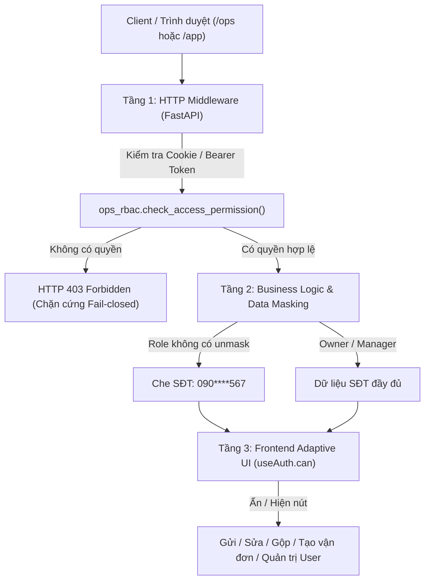

# KIẾN TRÚC PHÂN QUYỀN RBAC ĐA VAI TRÒ (MULTI-ROLE RBAC) — AUTO_SOCIAL / JAVIS OS

> Hệ thống phân quyền được nâng cấp từ mô hình 3 role cơ bản (`staff`, `manager`, `owner`) lên mô hình **8 vai trò nghiệp vụ chuyên biệt**, đảm bảo nguyên tắc bảo mật chặt chẽ **Fail-Closed** và cách ly an toàn buồng lái kỹ thuật máy chủ.

---

## 1. Danh Mục 8 Vai Trò Cụ Thể (Roles Registry)

| STT | Mã Role (`role`) | Mã Code | Tên hiển thị vai trò | Cấp bậc | Phạm vi trách nhiệm chính |
|:---:|:---|:---:|:---|:---:|:---|
| 1 | `owner` | `OWN` | **Chủ sở hữu / Giám đốc** | 100 | Toàn quyền hệ thống, buồng lái máy chủ (`/app`), Terminal, MCP, cấu hình model AI, quản trị tài khoản và kích hoạt Kill Switch khẩn cấp. |
| 2 | `manager` | `MGR` | **Quản lý vận hành** | 80 | Quản lý toàn diện đội ngũ CSKH, chốt đơn và vận chuyển; xem SĐT khách đầy đủ (unmask), gộp/xoá CRM, cấu hình Care (suggest/auto), quét bình luận ngay, xem chi phí token AI. |
| 3 | `cskh` | `CSKH` | **Chuyên viên CSKH & Tư vấn** | 40 | Trực tiếp duyệt & chỉnh sửa nháp phản hồi AI, tiếp quản hội thoại Messenger/Zalo, tạo việc handoff, tạo đơn hàng từ chat, xem CRM (SĐT che bảo mật). |
| 4 | `sales` | `SALE` | **Chuyên viên Kinh doanh** | 40 | Quản lý đơn hàng, trích xuất đơn hàng từ chat khách, xác nhận đơn hàng, huỷ đơn kèm lý do, tiếp cận lead tiềm năng từ bình luận/tin nhắn. |
| 5 | `warehouse` | `KHO` | **Nhân viên Kho & Vận chuyển** | 30 | Xử lý đóng gói đơn hàng, tạo vận đơn sang GHTK/GHN/ViettelPost, in phiếu gửi hàng, tra cứu hành trình vận chuyển theo thời gian thực. |
| 6 | `marketing` | `MKT` | **Chuyên viên Marketing & TikTok** | 40 | Lên chiến dịch tiếp thị Autopilot, xuất bản nội dung TikTok Carousel/Video, xem Radar đối thủ, phân tích nguồn chuyển đổi (Attribution). |
| 7 | `technical` | `TECH` | **Kỹ thuật viên Kênh nối** | 40 | Kiểm tra kết nối các kênh (Facebook Fanpage, Zalo, Telegram, TikTok), giám sát webhook, chạy kiểm thử đánh giá chất lượng QA. |
| 8 | `staff` | `NV` | **Nhân viên chung (Mặc định)** | 30 | Vai trò tổng hợp cơ bản (tương thích ngược): Duyệt nháp Care, xem CRM che SĐT, tạo việc handoff, xử lý công việc được giao. |

---

## 2. Kiến Trúc Bảo Mật 3 Lớp

---

## 3. Bảng Ma Trận Phân Quyền Chi Tiết (RBAC Matrix)

| Phân hệ / Thao tác API | Mã quyền (Capability) | Owner | Manager | CSKH | Sales | Warehouse | Marketing | Technical | Staff |
|:---|:---|:---:|:---:|:---:|:---:|:---:|:---:|:---:|:---:|
| **Buồng lái máy chủ** (`/app`, `/terminal`, `/mcp`) | `console:access` | ✓ | ✗ | ✗ | ✗ | ✗ | ✗ | ✗ | ✗ |
| **Kill Switch dừng khẩn cấp** | `kill_switch:manage` | ✓ | ✗ | ✗ | ✗ | ✗ | ✗ | ✗ | ✗ |
| **Quản trị tài khoản** (`/ops/users`) | `users:manage` | ✓ | ✗ | ✗ | ✗ | ✗ | ✗ | ✗ | ✗ |
| **Xem danh bạ nhân sự** (`/ops/directory`) | `directory:view` | ✓ | ✓ | ✓ | ✓ | ✓ | ✓ | ✓ | ✓ |
| **Xem Hộp thư & Bình luận** (`/ops/inbox`) | `care:view` | ✓ | ✓ | ✓ | ✓ | ✗ | ✓ | ✗ | ✓ |
| **Duyệt / Sửa / Gửi nháp AI** | `care:reply` | ✓ | ✓ | ✓ | ✗ | ✗ | ✗ | ✗ | ✓ |
| **Cấu hình bot Care** (`suggest/semi/auto`) | `care:config` | ✓ | ✓ | ✗ | ✗ | ✗ | ✗ | ✗ | ✗ |
| **Kích hoạt Care `mode=full` (tự động gửi)** | `care:mode_full` | ✓ | ✗ | ✗ | ✗ | ✗ | ✗ | ✗ | ✗ |
| **Quét bình luận ngay** (`poll-now`) | `care:poll_now` | ✓ | ✓ | ✗ | ✗ | ✗ | ✗ | ✗ | ✗ |
| **Xem CRM (SĐT che `090****567`)** | `crm:view` | ✓ | ✓ | ✓ | ✓ | ✗ | ✗ | ✗ | ✓ |
| **Mở khoá xem SĐT đầy đủ** | `crm:unmask_phone` | ✓ | ✓ | ✗ | ✗ | ✗ | ✗ | ✗ | ✗ |
| **Ghi chú hồ sơ khách hàng** | `crm:edit` | ✓ | ✓ | ✓ | ✓ | ✗ | ✗ | ✗ | ✓ |
| **Gộp hồ sơ trùng / Xoá CRM** | `crm:merge_delete` | ✓ | ✓ | ✗ | ✗ | ✗ | ✗ | ✗ | ✗ |
| **Xem danh sách đơn hàng** (`/ops/orders`) | `orders:view` | ✓ | ✓ | ✓ | ✓ | ✓ | ✗ | ✗ | ✓ |
| **Tạo đơn hàng từ chat / thủ công** | `orders:create_edit` | ✓ | ✓ | ✓ | ✓ | ✗ | ✗ | ✗ | ✓ |
| **Xác nhận đơn hàng** (`confirm`) | `orders:confirm` | ✓ | ✓ | ✗ | ✓ | ✓ | ✗ | ✗ | ✗ |
| **Huỷ đơn hàng** (`cancel`) | `orders:cancel` | ✓ | ✓ | ✗ | ✓ | ✗ | ✗ | ✗ | ✗ |
| **Tạo vận đơn** (GHTK / GHN / ViettelPost) | `shipping:create_shipment`| ✓ | ✓ | ✗ | ✗ | ✓ | ✗ | ✗ | ✗ |
| **Cấu hình đối tác vận chuyển** | `shipping:config` | ✓ | ✓ | ✗ | ✗ | ✗ | ✗ | ✗ | ✗ |
| **Chiến dịch Autopilot Campaigns** | `marketing:campaigns` | ✓ | ✓ | ✗ | ✗ | ✗ | ✓ | ✗ | ✗ |
| **Đăng bài TikTok (Carousel / Video)** | `marketing:social_publish`| ✓ | ✓ | ✗ | ✗ | ✗ | ✓ | ✗ | ✗ |
| **Đổi loop / kit account TikTok** | `tiktok:config` | ✓ | ✗ | ✗ | ✗ | ✗ | ✗ | ✗ | ✗ |
| **Xem trạng thái kênh kết nối** | `channels:view` | ✓ | ✓ | ✓ | ✗ | ✗ | ✓ | ✓ | ✓ |
| **Cấu hình kết nối kênh / Webhook** | `channels:manage` | ✓ | ✓ | ✗ | ✗ | ✗ | ✗ | ✓ | ✗ |
| **Kiểm thử đánh giá QA** (`/ops/qa`) | `qa:view_run` | ✓ | ✓ | ✗ | ✗ | ✗ | ✗ | ✓ | ✗ |
| **Xem Bảng việc Kanban** (`/ops/tasks`) | `tasks:view_manage` | ✓ | ✓ | ✓ | ✓ | ✓ | ✓ | ✓ | ✓ |
| **Giao việc cho nhân sự bất kỳ** | `tasks:assign_all` | ✓ | ✓ | ✗ | ✗ | ✗ | ✗ | ✗ | ✗ |
| **Xem Báo cáo Xu hướng** (`Trends`) | `analytics:view_trends` | ✓ | ✓ | ✗ | ✗ | ✗ | ✓ | ✗ | ✗ |
| **Xem Chi phí Token AI** (`/usage/*`) | `analytics:view_token_cost`| ✓ | ✓ | ✗ | ✗ | ✗ | ✗ | ✗ | ✗ |
